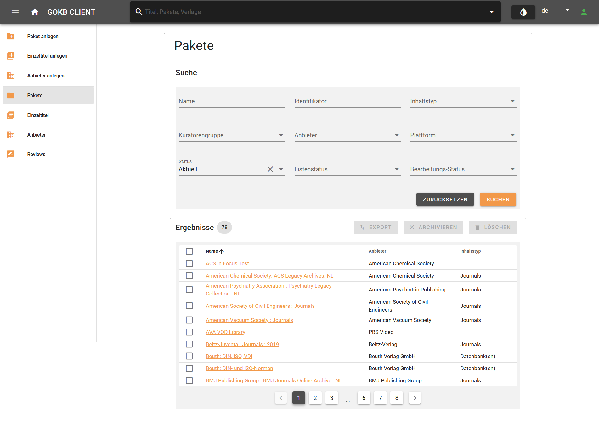
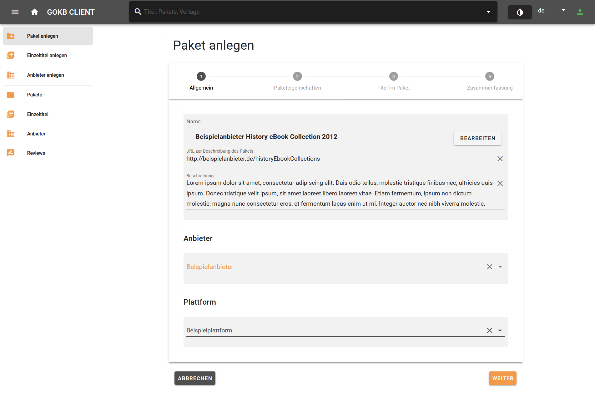
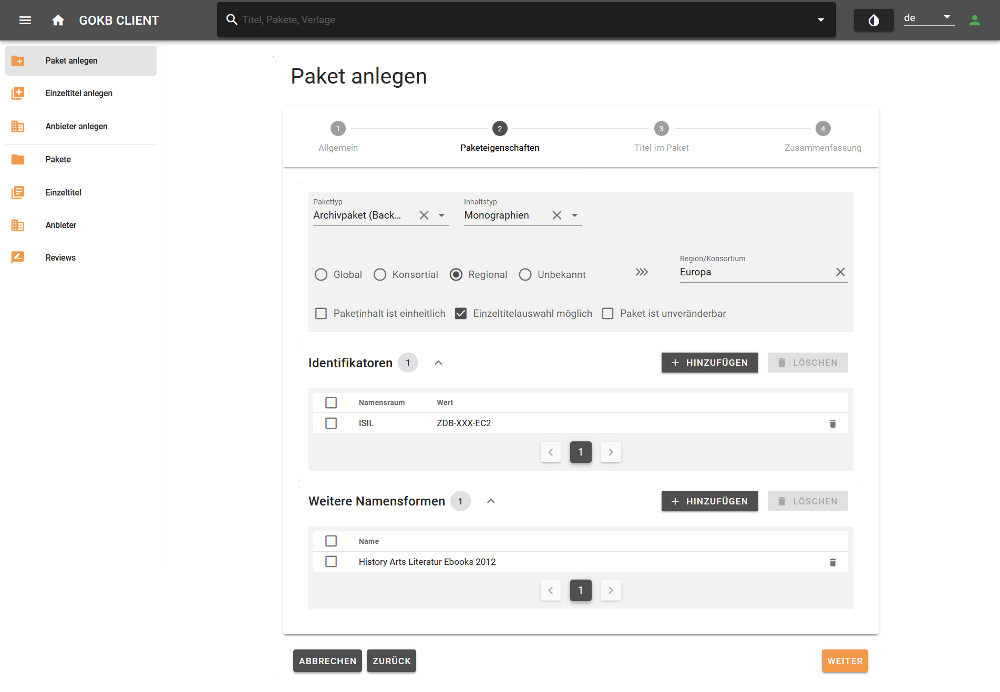
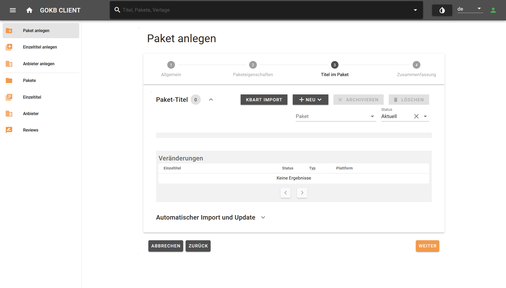
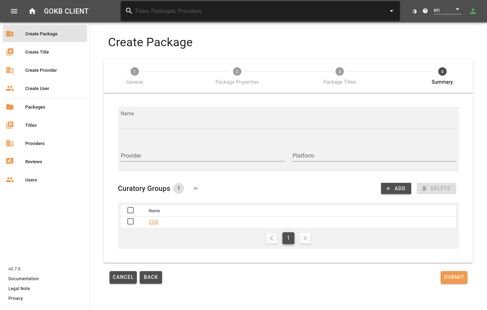

# Anlegen und Pflege von Paketen

## KBART-Listen besorgen und prüfen

Paket- und Titeldaten werden in Form von KBART-Dateien in die GOKb eingespielt.

KBART

KBART ist ein [NISO-Standard](https://groups.niso.org/apps/group_public/download.php/16900/RP-9-2014_KBART.pdf) zur Darstellung von Titeln in einem Paket. Eine entsprechende Beispiel KBART-Datei, die auch GOKb-relevante Erweiterungen des Standards sowie Erklärungen zu den einzelnen KBART-Felder beinhaltet, findet sich hier:  [Einführung in KBART](./kbart-introduction.md)

### 1. Korrektheit der KBART-Datei

Dabei ist darauf zu achten, dass die KBART-Datei korrekt ist, d.h.

+   Die Datei muss formal korrekt sein.
    +   Die Feldbezeichnungen und -inhalte müssen dem KBART-Standard sowie dem Format der proprietären Erweiterungen der GOkb entsprechen. Eine Liste der Felder finden Sie [hier](./kbart-introduction.md).
    +   Alle Spaltenüberschriften müssen existieren - auch, wenn sie in der Tabelle keine Werte haben.
    +   Die Zeichenkodierung der Datei muss UTF-8 sein.
    +   Tabulator als Trennzeichen.
    +   Vorzugsweise alphabetische Reihenfolge der Titel.
    +   Der Dateiname muss dem Standard entsprechen.
+   Die Datei muss hinsichtlich ihres Inhalts dem tatsächlich vom Anbieter angebotenen Pakets entsprechen. d.h.
    +   Der Titelumfang und -inhalt muss dem verhandelten Paket entsprechen.
    +   Die Zugangs-URLs für einzelne Titel müssen korrekt sein. Es müssen außerdem allgemeingültige URLs sein, keine einrichtungsspezifischen URLs.
    +   Die Einzelressourcen müssen mit Identifikatoren versehen sein.
    +   Bei Serienpublikationen wie Journals müssen die Abdeckungsinformationen (Jahrgänge) der tatsächlich im angebotenen Paket enthaltenen Jahrgängen korrekt sein. Werden beispielsweise in einem Paket nur die Jahrgänge ab 1996 angeboten, muss sich das in den entsprechenden Spalten der KBART-Liste wiederfinden.

### 2. Pflichtfelder für fortlaufende Ressourcen (E-Journals, Serienstücke)  

|Element|KBART-Feld|Pflicht/Fakultativ|Bemerkung|
|-------|-----------|------------------|-----|
|Pubikationstyp der Ressource|publication_type|Pflicht|Essentiell zur Unterscheidung E-Journal / E-Book |
|Name der Publikation|publication_title|Pflicht||                  
|ZDBID|zdb_id|Fakultativ*|Mindestens einer der vier Identifikatoren muss vorhanden sein|
|Elektronische ISSN|online_identifier|Fakultativ*|Mindestens einer der vier Identifikatoren muss vorhanden sein|
|Print ISSN|print_identifier|Fakultativ*|Mindestens einer der vier Identifikatoren muss vorhanden sein|
|Proprietäre Anbieter-ID|title_id|Fakultativ*|Mindestens einer der vier Identifikatoren muss vorhanden sein|
|Abdeckungsbeginn|date_first_issue_online|Pflicht||                 
||num_first_vol_online|Fakultativ||               
||num_first_issue_online|Fakultativ||      
|Abdeckungsende|date_last_issue_online|Fakultativ||
||num_last_vol_online|Fakultativ||               
||num_last_issue_online|Fakultativ||
|Abdeckungstiefe (fulltext, abstracts)|coverage_depth|Pflicht||
|Direkte Zugriffs-URL|title_url|Pflicht||                 
|Medienart des Titels|medium|Fakultativ||    

### 3. Mandatory fields for monographs (e-books,audio and video streams)

|Element|KBART-Feld|Pflicht/Fakultativ|Bemerkung|
|-------|-----------|------------------|-----|
|Pubikationstyp der Ressource|publication_type|Pflicht|Essentiell zur Unterscheidung E-Journal / E-Book |
|Name der Publikation|publication_title|Pflicht||               
|Elektronische ISBN|online_identifier|Fakultativ*|Mindestens einer der vier Identifikatoren muss vorhanden sein|
|Print ISBN|print_identifier|Fakultativ*|Mindestens einer der vier Identifikatoren muss vorhanden sein|
|Digital Object Identifier (DOI)|doi_identifier|Fakultativ*|Mindestens einer der vier Identifikatoren muss vorhanden sein|
|Proprietäre Anbieter-ID|title_id|Fakultativ*|Mindestens einer der vier Identifikatoren muss vorhanden sein|
|Veröffentlichungsdatum der Publikation online|date_monograph_published_online|Pflicht|| 
|Bandnummer|monograph_volume|Fakultativ||
|Auflage|monograph_edition|Fakultativ|| 
|Reihentitel|monograph_parent_collection_title|Fakultativ||  
|Autor*in|first_author|Fakultativ|| 
|Herausgeber*in|first_editor|Fakultativ||  
|Direkte Zugriffs-URL|title_url|Pflicht||                 
|Medienart des Titels|medium|Fakultativ||    

Es werden von der GOKb u.a. nicht offizielle KBART-Felder unterstützt:

+  Für Serienpublikationen wird die ZDB-ID (siehe Abschnitt "Korrekte Aufnahme von Journals in der ZDB") im Feld `zdb_id` verwendet.
+  Die Paketbeitritts- und -austrittsdaten für einzelne Titel werden in den Datumsfeldern `access_start_date` und  `access_end_date` festgehalten. Diese sind hilfreich, um den historischen Stand eines Pakets zu einem bestimmten Zeitpunkt zu erhalten, also wann ein Titel innerhalb eines Pakets hinzugekommen bzw. wann dieser das Paket verlassen hat.
+   Für Monographien der Reihentitel: `monograph_parent_collection_title`.
+   Für verschiedene Medienarten das Feld: `medium`.

### 4. Hinweise

* Achten Sie darauf pro Paket möglichst globale Gesamttitellisten via KBART-Format in die GOKb einzuspielen. Spezielle Titelzuschnitte, die sich ggf. für verschiedene Bibliotheken aus diesem Gesamtpaket ergeben, werden erst in von der GOKb abhängigen Systemen wie z.B. in ERM-Systemen definiert. 
* Achten Sie bei Journal-Listen darauf, dass jeder Titel über entweder eine ZDB-ID, eine e-ISSNs oder zumindest eine korrespondierende Print-ISSN verfügt.
* Insbesondere bei Titeln aus E-Book-Paketen muss für jedes E-Book eine interne Titel ID (`title_id`) des Anbieters in der KBART-Liste angefügt sein, da andere Identifikatoren wie ISBN häufig nicht eindeutig sind.

## Suchen eines Pakets

Suchen Sie ein Paket über den Menüpunkt "Pakete" auf der linken Menüleiste. Sie können in der Maske über den Namen des Pakets, über den Anbieter des Pakets, über einen Identifikator, über den Status des Pakets eine Kuratorengruppe suchen bzw. filtern.

## Anlegen eines Pakets

Das Anlegen und das Bearbeiten eines Pakets wird über ähnliche Eingabemasken gesteuert. 

+ Sie legen ein Paket an über den Menüpunkt "Paket anlegen".
+ Sie bearbeiten ein bestehendes Paket, indem sie über "Suchen eines Pakets" nach dem Paket suchen und auswählen.

Beide Masken bestehen aus identischen Schritten. Lediglich der Schritt "Zusammenfassung" erscheint bei "Paket anlegen" als Schritt 1, bei "Paket bearbeiten" als letzter Schritt 4.

## Schritt 1: Allgemeine Daten

Hier können Sie die allgemeinen Daten zum Paket wie den Namen, Anbieter und die Plattform eintragen.

+ *Name:* Der offizielle Name des Pakets, unter dem es laut Anbieter angeboten wird. Falls Sie Daten auf ein schon existierendes Paket spielen wollen, müssen Sie hier den genau den Namen des Pakets in der GOKb eingeben (idealerweise mit Copy & Paste). Die Richtlinien zur Benennung von Paketen finden Sie [hier](./guidelines-for-package-names.md).
+ *URL:* Hier können Sie eine Informations-URL zum Paket hinterlegen, die auf die entsprechende Website des Anbieters verweist.
+ *Anbieter:* Wählen Sie hier den Anbieter des Pakets aus. Sie finden den Anbieter über eine Vorschlagsliste, wenn Sie in das Textfeld den Namen oder einen Teil des Anbieternamens eingeben. Eine Anleitung zum Anlegen des Anbieters finden Sie [hier](./create-and-edit-provider.md).
+ *Plattform:* Wählen Sie hier die Plattform des Pakets aus. Sie finden die Plattform über eine Vorschlagsliste, wenn Sie in das Textfeld den Namen oder einen Teil des Plattformnames oder der Plattform-URL eingeben. Eine Anleitung zum Anlegen des Plattform finden Sie  [hier](./create-and-edit-provider.md).

Beenden Sie die Eingabe mit Anwahl des Buttons "Weiter".

## Step 2: Paketeigenschaften

In diesem Schritt können Sie Anbieter, Identifikatoren, Plattformen und Kuratorengruppen festlegen.

+ *Pakettyp:* Hier können Sie festlegen, um was für ein Paket es sich handelt
    * _Laufendes Paket (Front File):_ Ein aktuelles Paket
    * _Archipaket (Back File):_ Ein Archivpaket
    * _Aggregator-Paket_
    * _Gesamttitelliste (Master File):_ Eine Gesamtliste aller angebotenen Ressourcen eines Anbieters
+ *Eingrenzung:* Hier können Sie festlegen, ob es sich um ein global angebotenes Paket handelt (_Global_), ob es sich um ein regional/national angebotenes Paket (_Regional_) handelt oder ob es sich um ein spezifisch auf ein Konsortium oder eine Einrichtung zugeschnittenes Paket handelt (_Konsortial_, _Lokal_). Falls eine Eingrenzung wie Regional, Konsortial oder Lokal vorliegt, können Sie diese Eingrenzung im Textfeld spezifizieren.  
+ *Identifikatoren:* Hier können Sie die Identifikatoren für das Paket hinterlegen. Diese dienen dazu, das Paket eindeutig aufzufinden. Wählen Sie hier unter _**Namensraum**_ den Typ des Identifikators (z.B. das ISIL oder den Namensraum des internen Identifikator) und tragen Sie im folgenden Feld den entsprechenden Wert ein.  
    * _Interner Identifikator:_  Wenn das Paket einen Identifikator des Anbieters selbst besitzt, wählen Sie im Dropdown bitte den Namensraum des Anbieters aus, z.B. _emerald_. Im zweiten Feld geben Sie den internen Paketidentifikator ein, z.B. _EMX120_. Dieser ist für spätere Referenzierung wichtig. 
    * _ISIL/Paketsigel:_ Falls Ihr Paket ein offizielles Produktkennzeichen der "[ISIL-Agentur](https://sigel.staatsbibliothek-berlin.de/startseite/)" besitzt, geben Sie dieses hier an. Sie finden es ggf. unter [https://sigel.staatsbibliothek-berlin.de/nc/suche/.](https://sigel.staatsbibliothek-berlin.de/nc/suche/) Bitte achten Sie darauf, dass Sie das korrekte Anbieter-Paketsigel einspielen. Die Sigelstelle vergibt Sigel auch für lizenzierte Pakete von Allianz-, National- oder Konsortiallizenzen. Das Sigel eines dieser Pakete sollten Sie nur dann übernehmen, wenn Sie das entsprechende Allianz-,  National- oder Konsortiallizenzpaket einspielen.
* *Weitere Namensformen:* Hier können Sie Abkürzungen oder alternative Namensformen eintragen. Das empfiehlt sich, um gängige und bekannte Namensformen aufzunehmen, die nicht in der offiziellen Namensform enthalten sind. Namensformen, die hier eingetragen werden, können bei der Paketsuche gefunden werden.

Beenden Sie die Eingabe mit Anwahl des Buttons "Weiter".

## Step 3: Pakettitel

Hier sehen Sie eine Übersicht der im Paket enthaltenen Titel.

+ Sie können über das Suchfeld im Tabellenkopf nach einzelnen Titeln suchen.
+ Sie können Pakettitel über die Auswahl "Status" filtern und sich beispielsweise nur aktuelle, ehemalige (_archiviert_) oder künftig erwartete Titel anzeigen lassen.

Über eine Anwahl eines Titels gelangen Sie in eine Detailsicht.

### 5. Hochladen einer KBART-Datei

Über diese Sicht können Sie Pakettitel aus einer KBART-Datei in das Paket laden. Der Prozess des Hochladens von Pakettiteln kann sehr zeitaufwändig sein. Daher werden Sie das Ergebnis hier nicht in Echtzeit sehen. Schließen Sie nach Auswahl der KBART-Datei bzw. der Einstellung des automatischen Imports die Bearbeitung des Pakets ab. Sie werden über das Dashboard über den Stand des Einspielens der Titel informiert.

#### 5.1 Manuelles Laden einer KBART Datei

Über den Button "KBART-Import" können Sie eine KBART-Datei laden. Es öffnet sich ein modaler Dialog. Geben Sie hier bitte folgende Daten an.

+   *Datei:* Wählen Sie eine KBART-Datei von Ihrer Festplatte
+   *Namensraum für `title_id`:* Wählen Sie bitte den Namensraum des Identifikators, der sich in der Datei unter der Spalte `title_id` befindet.  
+   *Teil-Update:* Wählen Sie dieses Feld an, wird der Inhalt der hochzuladenden KBART-Datei nicht komplett aktualisiert, sondern nur um die hochzuladenden Titel ergänzt.

Sie bekommen nach dem Hochladen eine Übersicht über mögliche Fehler in der KBART-Datei. In dem Fall muss die KBART-Datei überarbeitet und erneute hochgeladen werden.

#### 5.2 Automatisches Laden einer KBART-Datei per URL

+   URL: Geben Sie hier die URL ein, unter der die KBART-Datei zu finden ist. Die URL muss direkt auf die KBART-Datei verlinken, nicht ggf. auf eine vorgelagerte Auswahlseite. Ist die KBART-Datei unter einer zeitlich veränderbaren URL zu finden (z.B. das fiktive Beispiel _http://kbart/2020/10/MeinPaket_2020-10-01.txt_, müssen Sie die zeitlich variablen Felder in folgender Form codieren (In unserem Beispiel: _http://kbart/{yyyy}/{mm}/MeinPaket\_{yyyy-mm-dd}.txt_):
    *   Runde Klammern {} für den zeitlich variablen Teil
    *   y für die Stellen der Jahreszahl
    *   m für die Stellen der Monatszahl
    *   d für die Stellen der Tageszahl
*   Aktualisierungszyklus: Aktualisierungsturnus des Pakets. Geben Sie unter Turnus eine Zahl ein und wählen Sie unter Einheit eine Zeiteinheit aus, um den Aktualisierungszyklus festzulegen. Wählen Sie beispielsweise  "2" und "Monat(e)", wird alle zwei Monate das Paket per URL aktualisiert. Die Standardeinstellung ist "1 Tag", also täglich.

#### Namensraum für `title_id` 

KBART-Dateien erlauben unterschiedliche Namensräume in der KBART-Spalte `title_id` angegeben ist. Typischerweise kommen vor: 

+ Eine interne Nummer des Anbieters (Beispielhaft kann hier eine Zahl oder eine Buchstabenkombination vorkommen). Wählen Sie bitte den Namensraum des Anbieters, der in der Regel der Kurzform des Anbieternamens entspricht. Sollte der Namensraum nicht existieren, melden Sie sich bitte bei [info\_at\_gokb.org](mailto:info@gokb.org). 
+ Ein [Digital Object Identifier (DOI)](https://www.doi.org/) (Beispielhaft: _10.1093/ajae/aaq063_). Dabei ist die reine DOI ohne eine komplette URL (**_[http://dx.doi.org/10.1093/ajae/aaq063](http://dx.doi.org/10.1093/ajae/aaq063)_**) eindeutig vorzuziehen. Wenn eine komplette URL in das Feld eingetragen wird, gibt das Interface eine Warnung aus.
+ Eine ISBN oder e-ISSN. 

Für spätere korrekte Aktualisierungen des Pakets ist es wichtig, dass diese Nummer mit in die GOKb übernommen wird. Daher ist es wichtig, den Namensraum korrekt anzugeben.

## Schritt 4: Zusammenfassung

Hier finden Sie eine Zusammenfassung der gewählten Einstellungen. Ihre präferierte Kuratorengruppe wird automatisch hinzugefügt.

