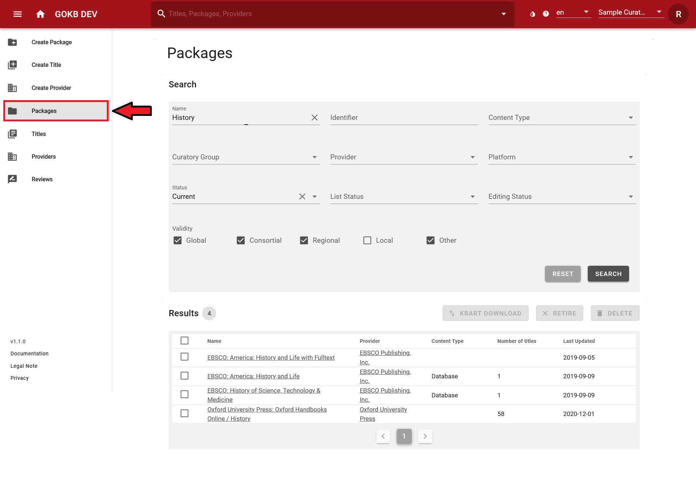
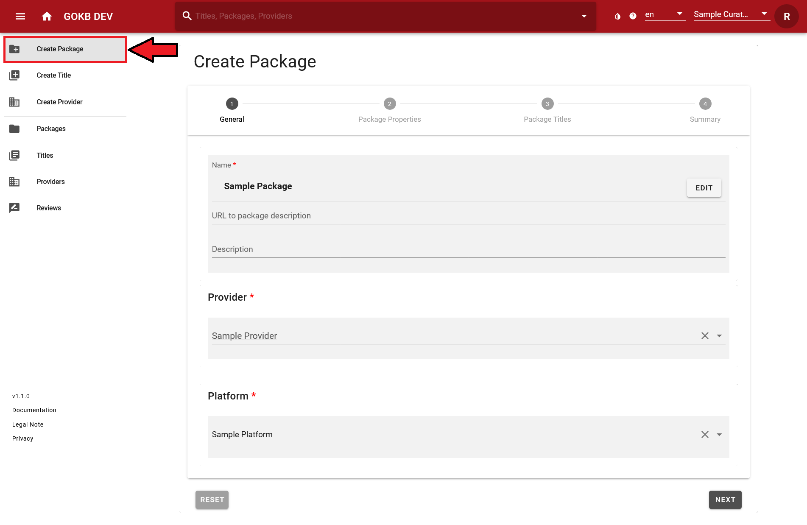
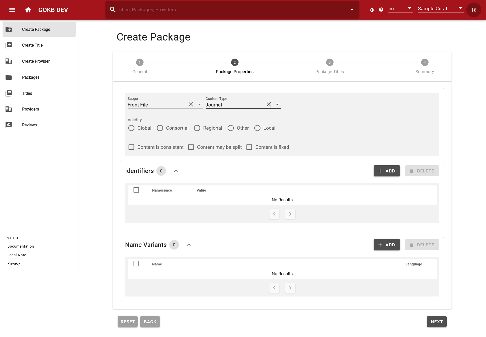
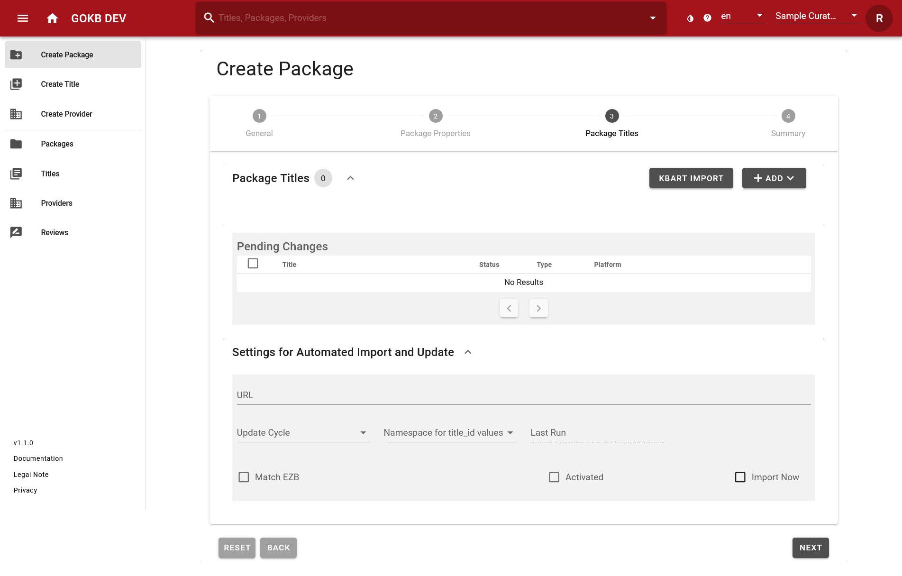
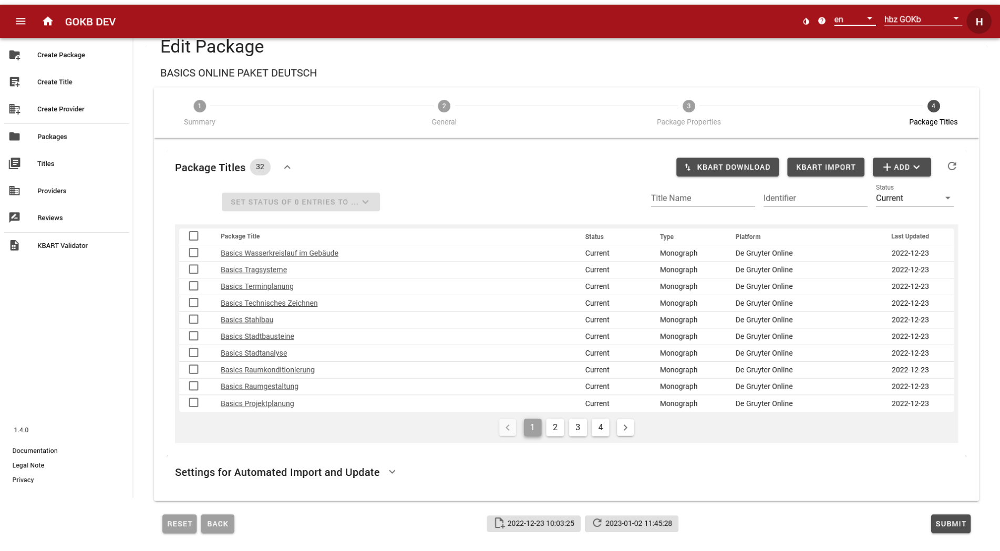
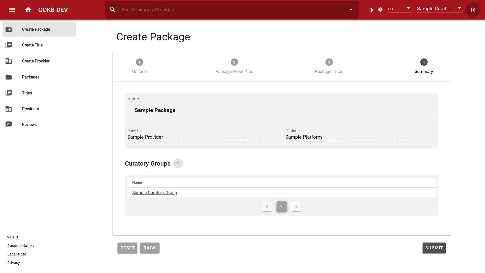

# Create and edit packages

## Get and check KBART files

Package and title data are imported into GOKB from KBART files.

KBART is a NISO standard for representing titles in a package of e-resources. 
A corresponding example KBART file, which also contains GOKB-relevant extensions 
of the standard as well as explanations of the individual KBART fields, 
can be found here: [KBART Introduction](./kbart-introduction.md)

### 1. Validation of the KBART file

KBART files must comply with the KBART standard:

+ The field names and contents must comply with the KBART standard or the enhanced 
GOKB format. A list of all fields can be found [here](./kbart-introduction.md).
    * All column headers must exist - even if a column has no values.
    * The character encoding must be UTF-8.
    * Tab as separator.
    * Preferably alphabetical order of the titles.
    * The file name must correspond to the standard.
+ The file must contain all current titles of the package offered by the provider, i.e.
    + The title scope and content must correspond to the negotiated package.
    + The access URLs for individual titles must be correct. 
    They must also be universally valid URLs, not institution-specific URLs like proxy URLs.
    + Each resource must be tagged with identifiers.
    + For serial publications like journals, the coverage information (years) 
    must be correct. For example, if only volumes from 1996 onward are offered 
    in a package, this must be reflected in the appropriate columns of the KBART list.

### 2. Mandatory fields for serials (e-journals, serials) 

|Element|KBART field|Mandatory/Optional|Notes|
|-------|-----------|------------------|-----|
|Publication type |publication_type|Mandatory|Essential for distinction of E-Book and E-Journal|    
|Publication title|publication_title|Mandatory||                  
|ZDB identifier|zdb_id|Optional*|At least one identifier must be provided|
|Electronic ISSN|online_identifier|Optional*|At least one identifier must be provided|
|Print ISSN|print_identifier|Optional*|At least one identifier must be provided|
|Proprietary identifier used by the content provider|title_id|Optional*|At least one identifier must be provided|
|Coverage start|date_first_issue_online|Mandatory||                 
||num_first_vol_online|Optional||               
||num_first_issue_online|Optional||      
|Coverage end|date_last_issue_online|Optional||
||num_last_vol_online|Optional||               
||num_last_issue_online|Optional||
|Coverage depth (fulltext, abstracts)|coverage_depth|Mandatory||
|Title level URL|title_url|Mandatory||                 
|Media type |medium|Optional||    

### 3. Mandatory fields for monographs (e-books,audio and video streams)

|Element|KBART field|Mandatory/Optional|Notes|
|-------|-----------|------------------|-----|
|Publication type |publication_type|Mandatory|Essential for distinction of E-Book and E-Journal|    
|Publication title|publication_title|Mandatory||                  
|Electronic ISBN|online_identifier|Optional*|At least one identifier must be provided|
|Digital Object Identifier (DOI)|doi_identifier|Optional*|At least one identifier must be provided|
|Proprietary identifier used by the content provider|title_id|Optional*|At least one identifier must be provided|
|Print ISBN|print_identifier|Optional||
|Date when monograph was published online|date_monograph_published_online|Mandatory|| 
|Volume number|monograph_volume|Optional||
|Edition number|monograph_edition|Optional|| 
|Series statement for a series title|monograph_parent_collection_title|Optional||  
|Author|first_author|Optional|| 
|Editor|first_editor|Optional||  
|Title level URL|title_url|Mandatory||                 
|Media type (journal, book, database) |medium|Optional||

GOKB supports the enhancement of KBART with some proprietary fields:

+ For serial publications, the ZDB id can be added to field `zdb_id`.
+ Dates when a title is added or removed for a package can be added to `access_start_date` 
and `access_end_date` fields. These dates are useful for obtaining the historical status 
of a package at a particular time.
+ For series of monographs the series statement can be added to `monograph_parent_collection_title` field.
+ Use field `medium` for different media type.

### 4. Notes

* Make sure to import generic title lists into GOKB for each package. 
Special, locally tailored packages (e.g. different access URL via proxy) 
from these generic packages, should only be used in local ERM systems.
* For journal lists, make sure that each title has either a ZDB id, an 
e-ISSNs, or at least a corresponding print ISSN.
* All titles, especially from e-book packages, should have an internal, 
provider specific title ID (`title_id`), as other identifiers such as 
ISBNs are often ambiguous.

## Searching a package

Use the "Packages" menu item on the left menu bar for the search of 
packages. You can search or filter curatory groups, names of the packages, 
provider identifier and status of the package. Select a package from the result 
list and you will get a detailed view of the package. If the package is assigned to 
your curatory group, you can edit it.

## Create a package

The creation and editing of packages is done via web forms.

+ Create a new package via "Create Package".
+ To edit an existing package, search for it via "Packages" and select the package from the result list.

## Step 1: General information

Add some general information for the package like name, provider and platform.

+ **Name:** The official name of the package under which it is offered according to 
the provider. If you want to add data to an existing package, enter the exact name 
of the package in "Search" field. See [guidelines](./guidelines-for-package-names.md) 
for naming packages.
+ **URL:** Add the URL of the website of the package provider.
+ **Provider:** Select the provider of the package here. You can find the provider via 
a suggestion list if you enter the name or part of the provider name in the text field. 
See [instructions](./create-and-edit-provider.md) for creating the provider.
+ **Platform:** Select the platform of the package here. You can find the platform via 
a suggestion list by entering the name or a part of the platform name or the platform 
URL into the search fields. See [instructions](./create-and-edit-provider.md) for 
creating a platform.

Finish this step by selecting the "Next" button.

## Step 2: Package properties

Add information about the package, identifiers, name and variants.

+ **Package type (Scope):** specify the package type
    * _Front File:_ a current package
    * _Archive package (Back File):_ An archived package
    * _Aggregator package_
    * _Master File:_ A complete list of all resources offered by a provider.
+ **Content Type:** specify the type of titles in the package
    * _Book_
    * _Database_
    * _Journal_
    * _Mixed_
+ **Restriction:** Define if the package is offered worldwide (Global), regionally (Regional) 
or is specifically tailored to a consortia (Consortial) or a single institution (Local). 
If there is a restriction like "Regional", "Consortial" or "Local", you can specify 
this restriction in the text field. Please follow the [guidelines](./guidelines-for-package-names.md) 
for package titles. 
+ **Package characteristics:** Here you can specify characteristics of a package.
   * _Content is consistent:_ Does the package have the same content for all licensing libraries? – _Yes_ if the content is the same for every library.
     _No_ (default) if the content differs from library to library.
   * _Content may be split:_ Can an individual title selection be made from the package, e.g. on the basis of pick and choose? – 
     _Yes_ if single title selection is possible. _No_ (default) if single title selection is not possible.
   * _Content is fixed:_ Can the content of the package change, i.e. can titles be added or removed over time? – 
     _Yes_ if the content remains fixed. _No_ (default) if the content changes.
+ **Identifiers:** Add unique identifiers for the package. Select a "Namespace" for the 
identifier and enter the corresponding identifier.
    * _Internal identifier:_ If the package has an identifier of the provider itself, 
    please select the namespace of the provider in the drop-down and enter the internal 
    package identifier. This is important for later referencing.
    * _ISIL/Package Label:_ Official product label from the German 
    "[ISIL agency](https://sigel.staatsbibliothek-berlin.de/startseite/)". You may find 
    it at https://sigel.staatsbibliothek-berlin.de/nc/suche/. Please be sure to include 
    the correct vendor package ISIL. The German ISIL Agency also issues ISIL for packages 
    of alliance, national or consortia licenses. You should only add one ISIL referencing the packages.
+ **Name variants:** Abbreviations or alternative name variants. This is recommended for common 
and well-known name variants that are not included in the official name. Name variants can be searched. Please note that the alternative name is a variant of the package name and not a variant of the provider name.
+ **Editing and List Statuss:** In editing mode (not in creating mode) you can change the editing and list 
  status of the package. 
  * _Editing Status:_ Here you can set the status to _Approved_ as soon as you have entered all necessary 
    metadata of the package. The default value is _In progress_.
  * _List  Status:_ Here you can set the status to _Checked_ as soon as the package title list is correct and checked.
    The default value is _In progress_. You can't change the list status as long as there are open review 
    requests appending to the package. The list status is important for importing into third-party systems such as FOLIO, because packages without the status _Checked_     will not be taken over. Furthermore, after the status is changed to _Checked_, the respective date is automatically displayed in "Last list verification". This           allows users of the package to see when it was last intellectually processed.

Finish this step by selecting the "Next" button.

## Step 3: Package titles

You can import a KBART file (see "Uploading a KBART file") here and add individual package titles. This view corresponds to the view of step 4 in "Edit package".

If you have already uploaded package titles (so if you are now in step 4 of "Edit package"), you will see an overview of all titles included in the package with the date of the last update at this point.

+ You can search for titles using the search field in header.
+ You can filter titles using the "Status" selection drop-down menu, 
e.g. only current, retired or deleted titles.

Select a title from the list to get detailed information for it.

In the title overview as well as on each step in the "Edit package" mode, the date of the creation of the package and the date of the last update to the package data are displayed at the bottom of the page. The date of the update is important for third-party systems that retrieve data based on the last update (such as via the OAI-PMH interface).

### Uploading a KBART file

Uploading package title via KBART files can be very time consuming. Therefore, 
you will not see the result in real time. After selecting the KBART file or setting 
the automatic import, finish editing the package. You will be informed about the titles 
import status via the "Dashboard".

#### 1. Manual loading of a KBART file

You can load a KBART file by selecting the "KBART Import" button. A pop-up window opens, 
please enter:

+ **File:** Select a KBART file from your hard disk.
+ **Namespace for `title_id`:** Please select the namespace of the identifier, see [instruction](./create-and-edit-packages.md).

In addition, you can choose between various import options:

+ **Partial Update:** If you check this box only titles from the new KBART file will be added to the existing package.
+ **Delete removed titles:** If you check this box package titles that are no longer included in the new KBART file will be marked as
  "deleted" in the existing package.
+ **Dry Run:** If you check this box, the KBART file will only be processed as a test run.

The two options Partial Update and Delete removed titles are related to each other as follows:

+ **Partial Update** = _no_, **Delete removed titles** = _no_ > The status of the currently available package titles that are not contained in the KBART file is set to "retired".
+ **Partial Update** = _no_, **Delete removed titles** = _yes_ > The status of the currently existing package titles that are not contained in the KBART file is set to "deleted".

If you select **Partial Update**, the option **Delete removed titles** is ignored. It therefore makes no sense to link the two options:

+ **Partial Update** = _yes_, **Delete removed titles** = _no_ > The status of the currently existing package titles is not changed. Only the titles from the KBART file are added.
+ **Partial Update** = _yes_, **Delete removed titles** = _yes_ > The status of the currently existing package titles is not changed. Only the titles from the KBART file are added.

After uploading the file you will get statistics on validation errors. If necessary the KBART file has to be 
corrected manually and reloaded.

#### 2. Automatic loading of a KBART file via URL

+ **URL:** URL of the KBART file. The URL must link directly to the KBART file. If the 
URL contains dates (e.g., http://example.org/kbart/examplepackage_2020-10-01.txt), 
you must add the path parameter as variables (http://example.org/kbart/examplepackage_{YYYY-MM-DD}.txt). The variables 
have to be capitals, lower case letters won't work:
    * "Y" for the digits of the year
    * "M" for the digits of the month number
    * "D" for the digits of the day number
+ **Namespace:** Please select the namespace of the identifier, see [instruction](./create-and-edit-packages.md).
+ **Update cycle:** The timespan package for updates.

#### Namespace for `title_id` values

KBART allows different identifiers for `title_id` column. Select the corresponding namespace for the KBART 
file. For updates of the package this is important, please specify the correct namespace.

## Step 4: Summary

Summary of the selected settings. Your selected curatory group will be added automatically. 

