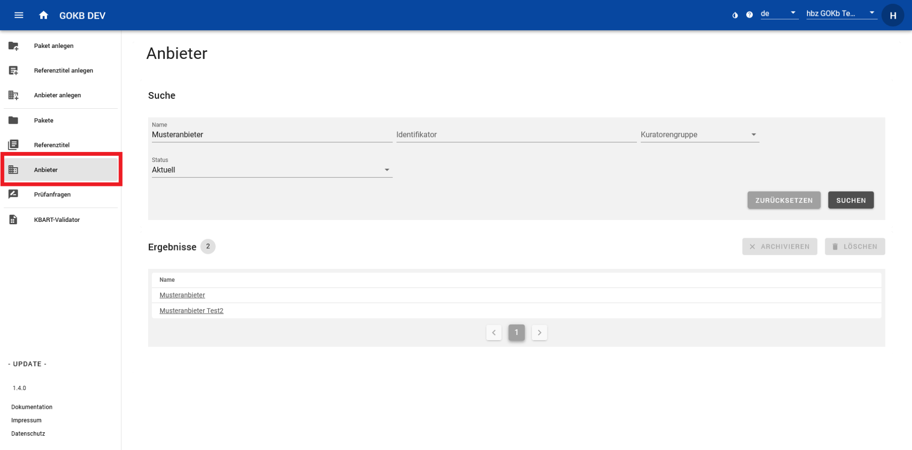
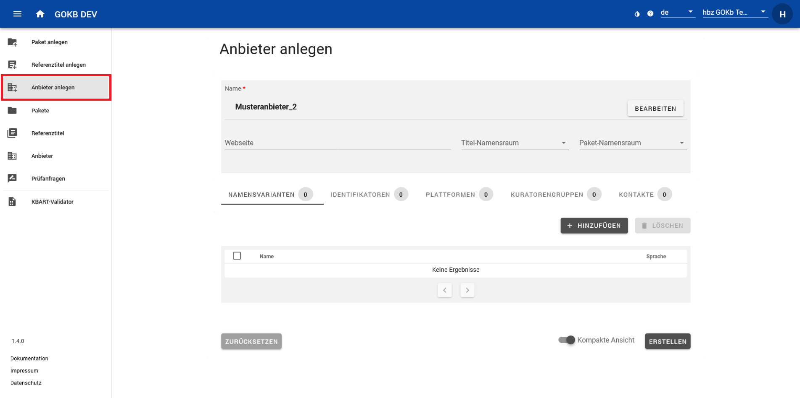

# Anlegen und Pflege von Anbietern

## Suchen eines Anbieters

Suchen Sie einen Anbieter über den Menüpunkt "Anbieter" in der linken Menüleiste. Sie können in der Maske über den Namen des Anbieters, über einen Identifikator des Anbieters oder eine Kuratorengruppe suchen bzw. filtern.

Über die Anwahl des Anbieternamens in der Ergebnisliste gelangen Sie auf die Detailsicht des Anbieters. Wenn dieser Anbieter Ihrer Kuratorengruppe zugeordnet ist, können Sie diesen bearbeiten.

## Anlegen und Bearbeiten eines Anbieters

Das Anlegen und Bearbeiten eines Anbieters wird über Eingabemasken gesteuert.
Bevor Sie über den Menüpunkt „Anbieter anlegen“ einen neuen Eintrag erstellen, prüfen Sie über die Anbietersuche (siehe oben), ob dieser schon existiert, damit keine Dublette entsteht. 

### Bearbeiten eines Anbieters

Über die Anbietersuche (siehe oben) und Auswahl des entsprechenden Anbieters in der Ergebnisliste gelangen Sie zur Maske "Anbieter bearbeiten". Diese Ansicht entspricht der Ansicht "Anbieter anlegen".

### Anlegen eines Anbieters

Klicken Sie links im Menü auf „Anbieter anlegen“ und tragen Sie unter „Name“ den offiziellen Anbieternamen (über den Button „Bearbeiten“) sowie unter „Website“ die allgemeine URL, die zur Website des Anbieters führt, ein.

Im unteren Bereich der Eingabemaske können Sie mit Klick auf "Namensvarianten", "Identifikatoren", "Plattformen", "Kuratorengruppen" und „Kontakte“ weitere Daten zum Anbieter eintragen. Diese Bereiche haben eine einheitliche Benutzung:

+   Wählen Sie bei jedem Bereich "Hinzufügen", um über ein Dialogfenster die entsprechenden Daten einzutragen.
+   Über die Checkboxen am Zeilenanfang können Sie Daten löschen, indem Sie entweder einzelne Zeilen markieren oder über die oberste Checkbox alles auswählen und dann im Bereichskopf den Button "Löschen" betätigen. Bei den Identifikatoren stehen Ihnen als Löschoption zusätzlich Papierkorb-Icons zur Verfügung.

Detailliert können Sie hier folgende Daten anlegen: 

+ **Namensvarianten:** Hier können Sie Abkürzungen oder alternative Namensformen eintragen. Das empfiehlt sich, um gängige und bekannte Namensformen aufzunehmen, die nicht in der offiziellen Namensform enthalten sind. Namensformen, die hier eingetragen werden, können bei der Anbietersuche gefunden werden.
+ **Identifikatoren:** Wenn es Identifikatoren gibt, die den Anbieter beschreiben, können Sie diese hier eintragen. Wählen Sie hier unter "Namensraum" den Typ des Identifikators (z. B. die GND-Nummer) und tragen Sie im folgenden Feld den entsprechenden Wert ein.
+ **Plattform:** Hier können Sie die Plattform oder die Plattformen des Anbieters anlegen oder eine bestehende hinzufügen.
  Näheres zu Plattformen finden Sie unten. Über den Button "Hinzufügen" wird anhand der Eingabe eine bestehende Plattform
  vorgeschlagen, die Sie mit dem Anbieter verknüpfen können. Wird anhand des Namens oder der URL keine gefunden, wird eine
  neue angelegt und mit dem Anbieter verknüpft.
  Die Plattform wird definiert durch:
    * **Name:** Der Plattformname. Wenn die Plattform des Anbieters keinen offiziellen Namen hat, können Sie hier alternativ den Namen des Anbieters oder die URL selbst eintragen.
    * **URL:** Die Plattform-URL. Geben Sie die URL der Plattform im entsprechenden Feld ein.
* **Kuratorengruppe:** Ihre Kuratorengruppe wird anhand der präferierten Kuratorengruppe automatisch gesetzt.
* **Kontakte:** Hier können Sie die Mailadresse z.B. des technischen Supports der Plattform anlegen. 
    
Wenn Sie mit den Eingaben fertig sind, klicken Sie unten rechts auf den Button "Erstellen". Wenn Sie einen vorhandenen Anbieter bearbeitet haben, wählen Sie unten rechts den Button "Aktualisieren" an.

## Was ist eine Plattform?

Eine Plattform ist die Softwareumgebung eines Anbieters, über die man auf die Inhalte zugreifen kann, z. B. auf Journals, E-Books oder Datenbanken. Die Plattform zeichnet sich aus durch:

+ Eine URL-Domäne wie z. B. _http://www.thieme-connect.de_ (Es kann zusätzliche Subdomänen geben wie z. B _http://incites.clarivate.com)_.
+ Einen optionalen Namen (z. B. SpringerLink). Bei kleinen Anbietern gibt es keinen Namen, da es nur eine Plattform gibt – hier kann man als Namen frei z.B. den Anbieternamen nutzen. Wichtig ist die Auffindbarkeit.
