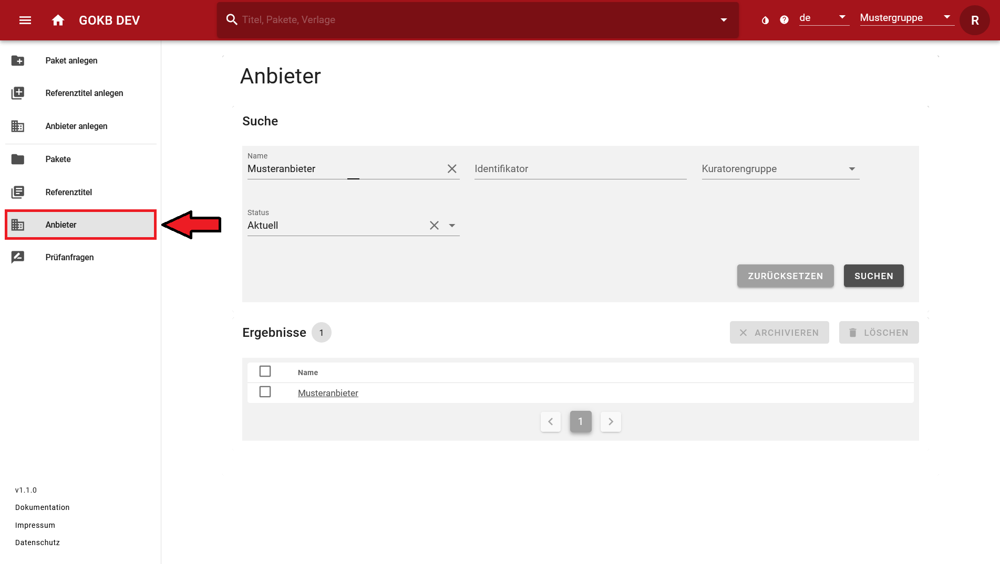

# Anlegen und Pflege von Anbietern

## Suchen eines Anbieters

Suchen Sie einen Anbieter über den Menüpunkt "Anbieter" auf der linken Menüleiste. Sie können in der Maske über den Namen des Anbieters, über einen Identifikator des Anbieters oder eine Kuratorengruppe suchen bzw. filtern.

Über die Anwahl des Anbieternamens in der Ergebnisliste gelangen Sie auf die Detailsicht des Anbieters. Wenn dieser Anbieter Ihrer Kuratorengruppe zugeordnet ist, können Sie diesen bearbeiten.

## Anlegen und Bearbeiten eines Anbieters

Anlegen und das Bearbeiten eines Anbieters wird über Eingabemasken gesteuert. 

### Anlegen eines Anbieters

Sie legen einen Anbieter über den Menüpunkt "Anbieter anlegen" an. Prüfen Sie vor dem Anlegen eines neuen Anbieters, ob dieser schon existiert, damit keine Dublette entsteht.

### Bearbeiten eines Anbieters

Sie gelangen über die Anbietersuche (siehe Anleitung) und Auswahl des entsprechenden Anbieters in der Ergebnisliste auf die Maske "Anbieter bearbeiten".

Tragen Sie hier folgende Daten ein:

+ **Name:** Offizieller Name des Anbieters. Wählen Sie hierzu den Button "Bearbeiten" an.
+ **Homepage:** Die allgemeine URL zur Homepage des Providers.
+ **Status:** Setzen Sie den Status des Anbieters.

In den folgenden Bereichen "Weitere Namensformen", "Identifkatoren", "Plattformen" und "Kuratorengruppen" können Sie weitere Daten zum Anbieter eintragen. Diese Bereiche haben eine einheitliche Benutzung:

+   Wählen Sie ggf. das Winkel-Icon neben dem Bereichsnamen an (z.B. "Weitere Namensformen"), 
um den Bereich ein- oder auszuklappen.
+   Wählen Sie bei jedem folgenden Bereichen "Hinzufügen", um über 
einen Dialog die entsprechenden Daten einzutragen.
+   Sie können Daten löschen, indem Sie
    *   entweder einzelne Zeilen über die Checkbox zu Beginn der Zeile 
    markieren und dann im Bereichskopf den Button "Löschen" betätigen.
    *   oder am Ende jeder Zeile das Papierkorb-Icon anwählen.

Detailliert können Sie hier folgende Daten anlegen: 

+ **Weitere Namensformen:** Hier können Sie Abkürzungen oder alternative Namensformen eintragen. Das empfiehlt sich, um gängige und bekannte Namensformen aufzunehmen, die nicht in der offiziellen Namensform enthalten sind. Namensformen, die hier eingetragen werden, können bei der Anbietersuche gefunden werden.
+ **Identifikatoren:** Wenn es Identifikatoren gibt, die den Anbieter beschreiben, können Sie diese hier eintragen. Wählen Sie hier unter "Namensraum" den Typ des Identifikators (z.B. die GND-Nummer) und tragen Sie im folgenden Feld den entsprechenden Wert ein.
+ **Plattform:** Hier können Sie die Plattform oder die Plattformen des Anbieters anlegen. Näheres zu Plattformen finden Sie unten. Die Plattform wird definiert durch:  
    *   **Name:** Der Plattformname. Wenn die Plattform des Anbieters keinen offiziellen Namen hat, können Sie hier alternativ den Namen des Anbieters oder die URL selbst eintragen.
    *   **URL:** Die Plattform-URL. Geben Sie die URL der Plattform in entsprechenden Feld ein.
* **Kuratorengruppe:** Ihre Kuratorengruppe wird anhand der präferierten Kuratorengruppe automatisch gesetzt.
* **Kontakte:** Hier können Sie die Mailadresse z.B. des technischen Supports der Plattform anlegen. 
    
Wenn Sie den Anbieter erstellt haben, wählen Sie unten rechts den Button "Erstellen" an. Wenn Sie einen vorhandenen Anbieter bearbeitet haben, wählen Sie unen rechts den Button "Aktualisieren" an.

## Was ist eine Plattform?

Eine Plattform ist die Softwareumgebung eines Anbieters, über die man auf die Inhalte zugreifen kann, z.B. auf Journals, E-Books oder Datenbanken. Die Plattform zeichnet sich aus durch:

+ Eine URL-Domäne wie z.B. _http://www.thieme-connect.de_ (Es kann zusätzliche Subdomänen geben wie z.B _http://incites.clarivate.com)_.
+ Einen optionalen Namen (z.B. SpringerLink). Bei kleinen Anbietern gibt es keinen Namen, da es nur eine Plattform gibt - hier kann man als Namen frei z.B. den Anbieternamen nutzen. Wichtig ist die Auffindbarkeit.
