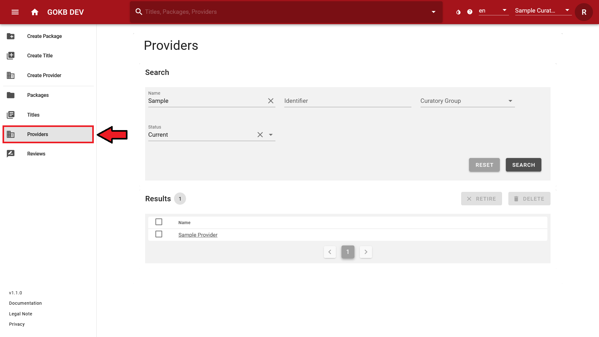
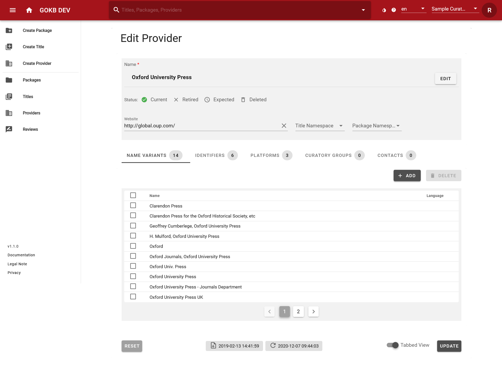

# Create and Edit Provider

## Search Provider

Search for a provider using the "Provider" menu item on the left menu bar. 
You can search or filter provider by name, identifier or curatory group.

After selecting a provider name in the results list you get a detailed view of the provider. If the provider is assigned to your curator group, you can edit it.

## Create and Edit Provider

You can create and edit provider data via web forms. Before creating a new provider, please check (see Search Provider) if it already exists to avoid duplicate entries in the database.

### Edit Provider

You can edit providers by searching for a provider (see instructions above), selecting the corresponding provider from the results list and clicking the button "Edit". This view corresponds to the view „Create Provider“.

### Create Provider

Create a provider via the menu item "Create Provider". Enter the official provider name (by clicking on the Button „Edit“) and the general URL that leads to the provider`s website (by clicking on „Website“).

In the lower section you can add further information about a provider by clicking on „Name Variants“, „Identifiers“, „Platforms“, „Curatory Groups“ and „Contacts“. These data fields have a uniform usage:

+ Select "Add" to enter data via a pop-up dialog.
+ You can use the checkboxes at the beginning of the lines to delete data, either by selecting individual lines or by selecting everything via the top checkbox and then pressing the "Delete" button. In the case of the identifiers, trash can icons are also available as a deletion option.

In detail, you can add the following data:

+ **Name variants:** Abbreviations or alternative name forms. Add common and well-known 
name forms that are not included in the official name form. Name variants that are entered here can be found in the Provider Search.
+ **Identifiers:** Identifiers that describe the provider. Select the "Namespace" 
of the identifier system and enter the identifier value.
+ **Platforms:** Here you can add the platform or platforms offered
  by a provider. Via the button "Add" an existing platform is suggested on the basis of the input
  which you can link to the provider. If none is found on the basis of the name or the URL, a new one will be created and
  linked to the provider.The platform is defined by:
  * **Name:** The platform name. If the provider's platform does not have an official name, you can enter the provider's name or the URL itself here.
  * **URL:** The URL of the platform.
+ **Curatory groups:** Your selected curatory group that will be responsible for maintaining the package will be added automatically.
+ **Contacts:**  E-Mail address of a provider contact such as technical support. 

Once you have added all provider data, select the "Create" or "Update" button at the bottom right.

## What is a platform?

A platform is a provider's software environment for accessing content, such as journals, 
e-books, or databases. A platform is characterized by:

+ A URL such as http://www.thieme-connect.de (There may be additional 
subdomains such as http://incites.clarivate.com).
+ An optional name (e.g. SpringerLink). For small providers, 
offering only one platform, use the provider name.
