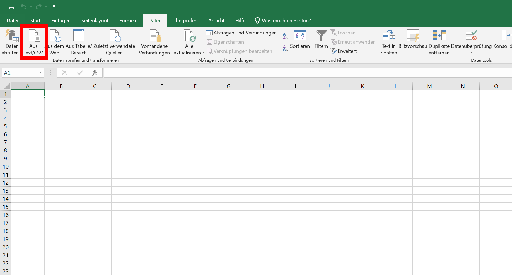
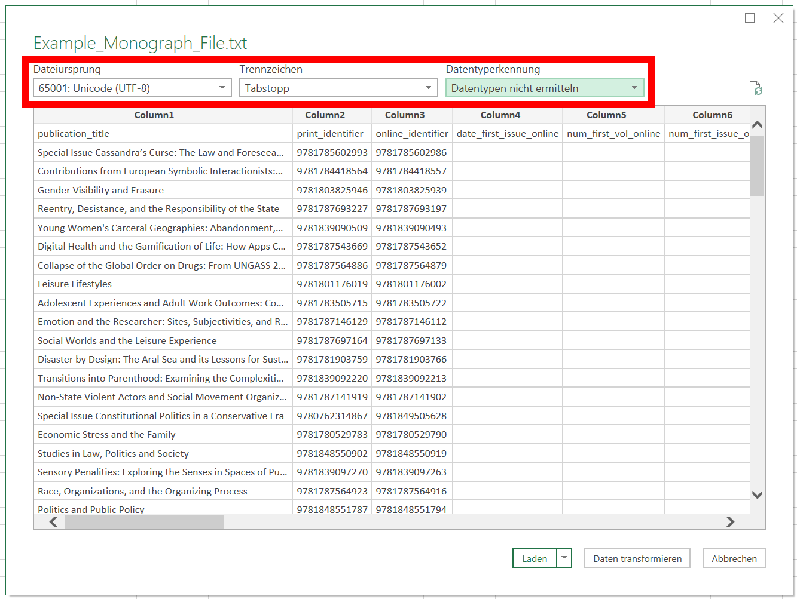
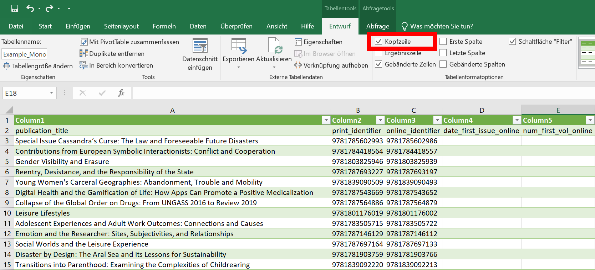
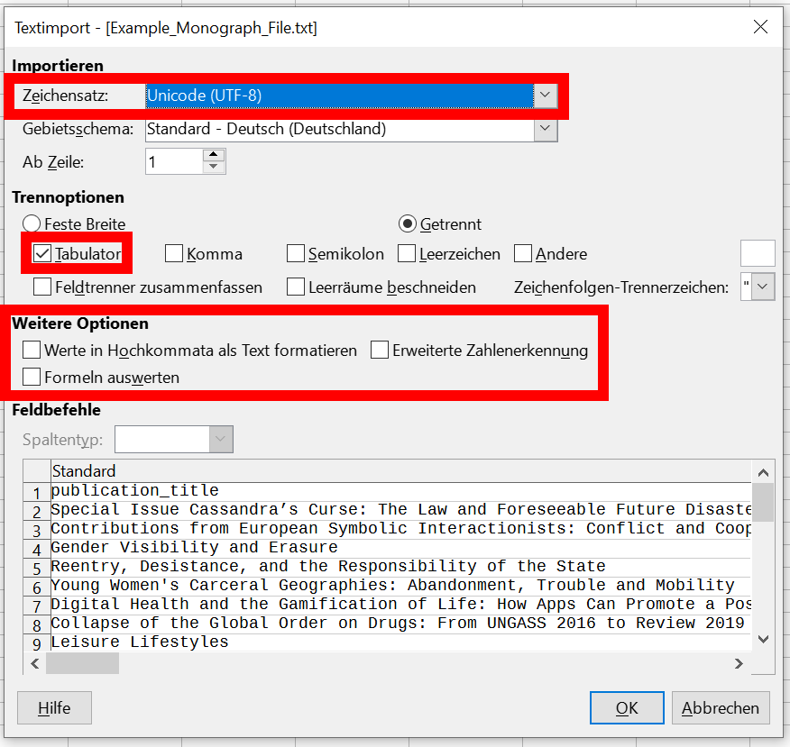
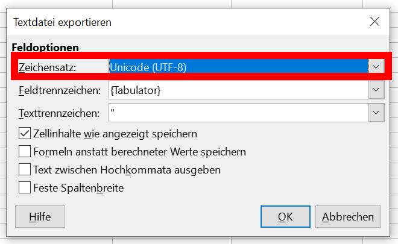

# Bearbeitung von KBART-Dateien

## Häufige Fehler
Bei der Bearbeitung von KBART-Dateien treten manche Fehler gehäuft auf, die unbedingt vermieden
werden müssen.

  * **Falscher Zeichensatz:** KBART-Dateien müssen im Zeichensatz UTF-8 vorliegen. Manche Anbieter
    weichen von dieser Norm ab, aber der Zeichensatz kann sich auch unbeanbsichtigt im Rahmen 
    der Bearbeitung von KBART-Dateien ändern. Daher muss der Zeichensatz immer überprüft werden.
  * **Umformatierung von Datumsangaben:** Datumsangaben wie Veröffentlichungsdatum, Abdeckungsdaten
    etc. müssen im Format YYYY-MM-DD vorliegen. Tabellenkalkulationsprogramme ändern dieses Format 
    manchmal automatisiert in andere Formatierungen wie DD.MM.YYYY. Diese Umformatierungen müssen
    vermieden werden.
  * **Umformatierung von ISBNs:** Manchmal liegt insbesondere die ISBN-13 ohne Bindestriche vor. 
    Tabellenkalkulationsprogramme deuten sie dann fälschlicherweise als numerischen Wert und 
    stellen sie in exponentieller Schreibweise dar (z.B. 9,78179E+12). Dadurch gehen die letzten 
    Stellen verloren. Die ISBN wird dadurch unbrauchbar.

## Microsoft Excel

KBART-Dateien können mit Excel nicht über das "Öffnen"-Menü geladen werden. Sie 
Sie müssen in einer leeren Arbeitsmappe über den Menüpunkt _Datei_ > _Aus Text/CSV_ 
importiert werden.

### Importeinstellungen

Es öffnet sich ein Importfenster. In diesem Fenster ist es äußerst wichtig, folgende
Einstellungen korrekt vorzunehmen:

  * _Dateiursprung:_ Hier können Sie die Zeichenkodierung auswählen, in der die KBART-Datei 
    vorliegt. Diese wird nicht automatisch von Excel erkannt. Excel schlägt die Kodierung
    "1252: Westeuropäisch (Windows)" vor, die in den meisten Fällen falsch ist. Laut NISO-
    Standard muss eine Kodierung als "65001: Unicode (UTF-8)" vorliegen. Wählen Sie diese 
    Kodierung aus dem Dropdown aus. _Hinweis:_ Es kann sein, dass Anbieter sich nicht an den NISO-)
    Standard halten und eine andere Kodierung wählen. Wählen Sie dann hier die vom Anbieter 
    genutze Kodierung aus. Zum Erkennen der Kodierung lesen Sie den Abschnitt "Zeichenkodierung
    erkennen und korrigieren".
  * _Trennzeichen:_ Für KBART-Dateien sind Tabstopps als Trennzeichen vorgegeben. Wählen Sie 
    daher Tabstopps aus. In der Regel ist diese Auswahl schon vorab eingestellt.
  * _Datentypenerkennung:_ Wählen Sie hier "Datentyp nicht ermitteln" aus, da Excel durch eine 
    fehlerhafte Datentyperkennung die Daten korrumpieren kann.

### Korrektur der Header-Zeile
Excel erkennt die Spaltenüberschriften-Zeile der KBART-Datei nicht als Überschriften an und fügt  
eine weitere Zeile hinzu. 

  * Entfernen Sie die Markierung dieser Zeile als Überschriftenzeile. Entfernen Sie dazu den  
    Haken unter _Entwurf_ > _Kopfzeile_
  * Löschen Sie die nun leere Zeile mit Rechtsklick auf die Zeilennummer "1" und Auswahl von 
    _Zellen löschen_ aus dem Kontextmenü

### Bearbeitung der KBART-Datei
Sie können die Datei nun beliebig bearbeiten. Beachten Sie bitte die Standards des KBART-Formats,
die [hier](./kbart-introduction.md) zusammengefasst sind.

### Speichern der KBART-Datei
Speichern sie die KBART-Datei über _Datei_ > _Speichern unter_. Nachdem Sie einen Speicherort
ausgewählt haben, erscheint ein Fenster. Hier müssen Sie folgende Einstellungen auswählen: 

  * _Dateityp_: "Text (Tabstopp-getrennt) (*.txt)
  * _Tools_ > _Weboptionen_ > Reiter _Codierung_ > _Dokument speichern als_: "Unicode (UTF-8)"

Sie bestätigen die Auswahl über "OK". Den nachfolgenden Hinweis, dass der Dateityp keine Arbeitsmappen
mit mehreren Blättern unterstützt, bestätigen Sie ebenfalls mit "OK".

*Wichtiger Hinweis:* Excel speichert trotz korrekten Vorgehens häufig in einer falschen 
Zeichenkodierung. Überprüfen Sie daher die Datei hinsichtlich ihrer Zeichenkodierung wie 
im Abschnitt "Zeichenkodierung erkennen und korrigieren" angegeben.

## LibreOffice Calc
[LibreOffice Calc](https://de.libreoffice.org/discover/calc/) ist ein freies 
Tabellenkalkulationsprogramm, das sich zur Bearbeitung von KBART-Dateien eignet. KBART-Dateien 
können einfch über _Datei_ > _Öffnen_ geöffnet werden.

### Importeinstellungen

Es öffnet sich ein Importfenster. In diesem Fenster ist es äußerst wichtig, folgende
Einstellungen korrekt vorzunehmen:

  * _Importieren:_ Hier können Sie die Zeichenkodierung auswählen, in der die KBART-Datei
    vorliegt. Diese wird nicht automatisch von LibreOffice Calc erkannt. LibreOffice Calc 
    schlägt die Kodierung "Unicode (UTF-8)" vor, die in den meisten Fällen kirrekt ist. Laut NISO-
    Standard muss eine Kodierung als "Unicode (UTF-8)" vorliegen. _Hinweis:_ Es kann sein, 
    dass Anbieter sich nicht an den NISO-Standard halten und eine andere Kodierung wählen. 
    Wählen Sie dann hier die vom Anbieter genutze Kodierung aus. Zum Erkennen der Kodierung 
    lesen Sie den Abschnitt "Zeichenkodierung erkennen und korrigieren".
  * _Trennoptionen:_ Für KBART-Dateien sind Tabstopps als Trennzeichen vorgegeben. Wählen Sie
    daher Tabstopps aus. In der Regel ist diese Auswahl schon vorab eingestellt.
  * _Weitere Optionen:_ Wählen Sie hier alle Optionen ab. Insbesondere die "Erweiterte 
    Zahlenerkennung muss ausgeschaltet sein, da eine fehlerhafte Zahlenerkennung 
    die Daten korrumpieren kann.

### Bearbeitung der KBART-Datei
Sie können die Datei nun beliebig bearbeiten. Beachten Sie bitte die Standards des KBART-Formats,
die [hier](./kbart-introduction.md) zusammengefasst sind.

### Speichern der KBART-Datei
Speichern sie die KBART-Datei über _Datei_ > _Speichern unter_. Hier müssen Sie folgende Einstellungen auswählen:

  * _Dateiname_: Geben Sie den Dateiname mit dem Suffix ".txt" oder ".tsv" an. Die GOKb 
    beide Endungen.
  * _Dateityp_: "CSV (*.csv)"
  * _Automatische Dateiendung_: Entfernen Sie den Haken an dieser Option
  * _Filtereinstellungen bearbeite_: Wählen Sie diese Option an.

Nach der Auswahl des Buttons "Speichern" bittet das Programm sie um eine Bestätigung, dass die 
Datei im CSV-Format abgespeichert werden soll. Bestätigen Sie den Dialog.

Anschließend öffnet sich ein neuer Dialog _Textdatei exportieren_. Nehmen Sie hier folgende
Einstellungen vor:

  * _Zeichensatz_: "Unicode (UTF-8)"
  * _Feldtrennzeichen_: "{Tabulator}"
  * Textrennzeichen: " " " (Hochgestellte doppelte Anführungszeichen)
  * _Zellinhalte wie angezeigt speichern_: Anwählen bzw. Haken setzen
  * Alle anderen Optionen: Abwählen bzw. Haken entfernen

Sie bestätigen die Auswahl über "OK". 

## Zeichenkodierung erkennen und korrigieren
Zum Erkennen und Bearbeiten der Zeichenkodierung empfiehlt das GOKb-Team das freie Tool
[Notepad++](https://notepad-plus-plus.org/). Da KBART-Dateien Textdateien sind, können sie mit 
dem Texteditor Notepad++ bearbeitet werden. 

Öffnen Sie die KBART-Datei in Notepad++. Im Regelfall erkennt Notepad++ die Zeichenkodierung der 
Datei und stellt sie in der Fußzeile des Fensters dar. Sollte die Kodierung nicht korrekt erkannt 
worden sein, erkennen Sie das an falschen Zeichen, die von Notepad++ schwarz unterlegt dargestellt
werden: 

  * Satzzeichen wie Apostrophe
  * Umlaute wie ä, ö, ü
  * Weitere Buchstaben und Zeichen außerhalb des lateinischen Standardalphabets (Akzente etc.)

Sie können über den Menüpunkt _Codierung_ die korrekte Zeichenkodierung der Datei auswählen, sodass
die genannten Zeichen korrekt dargestellt werden. Über denselben Menüpunkt _Codierung_ > _Konvertiere
zu UTF-8_ können Sie die Kodierung auf die korrekte, vom KBART-Standard empfohlene Zeichenkodierung
UTF-8 umstellen und anschließend abspeichern.

