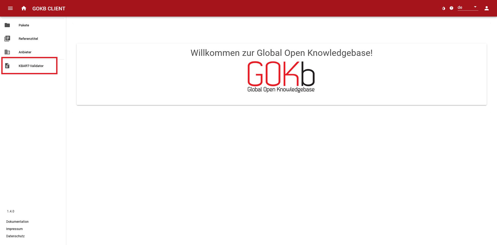
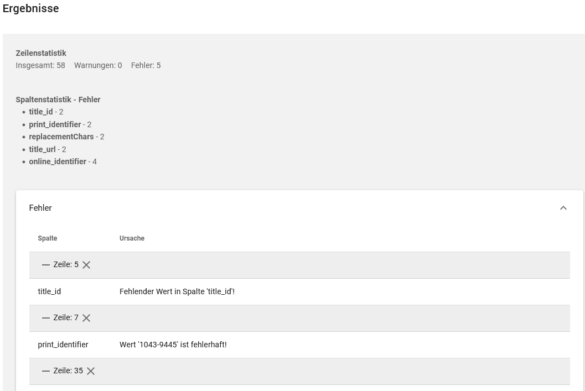
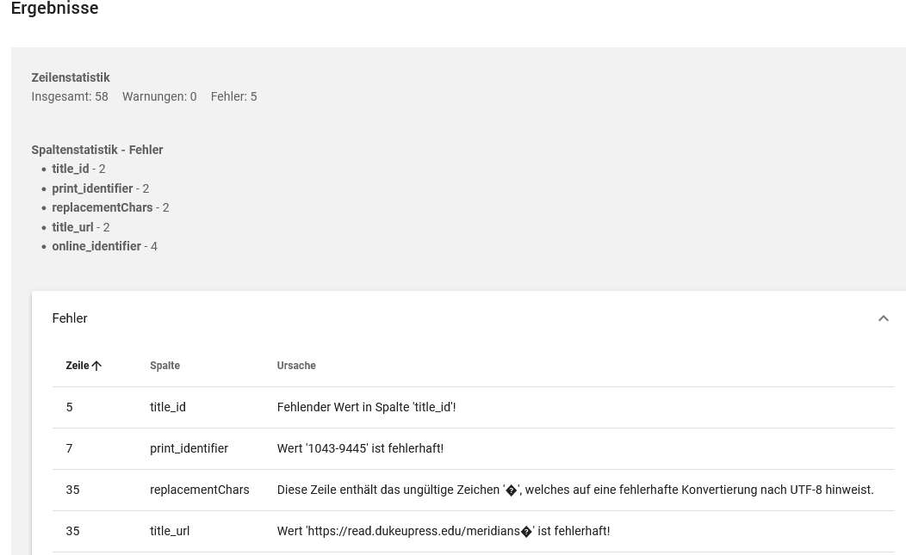

# KBART-Validator

Der KBART-Validator ist ein Tool, mit dem Sie KBART-Dateien auf ihre Konformität zum [NISO-Standard](https://www.niso.org/standards-committees/kbart) überprüfen können.

## Datei hochladen

Wählen Sie in der linken Menüleiste unten den Menüpunkt „KBART-Validator“.

Klicken Sie in das grau hinterlegte „Datei“-Feld, wählen Sie aus Ihren gespeicherten Dateien eine Datei aus und laden Sie diese über den „Öffnen“-Button hoch.

## Datei validieren

Wählen Sie anhand des Sliders aus, ob Sie die Daten im strikten oder nicht strikten Modus validieren lassen möchten. Im strikten Modus erfolgt der Validierungsvorgang streng nach dem NISO-Standard. Der nicht strikte Modus entspricht der Validierung beim Paket-Upload und es werden auch nicht standardkonforme Werte akzeptiert, die die GOKb akzeptiert und ggf. automatisch anpasst. 

Um den Vorgang zu starten, klicken Sie auf den Button „Validieren“. Sollte das Ergebnis nicht sofort erscheinen, zeigt Ihnen ein Ladesymbol an, dass der Validierungsvorgang noch aktiv ist. 

## Ergebnisse

Die angezeigten Ergebnisse der Validierung bestehen aus folgenden Informationen:

+   **Zeilenstatistik:**: Hier erhalten Sie eine Übersicht über die Zeilen der KBART-Datei (Datensätze), die mit Fehlern oder Warnungen versehen sind.
+   **Spaltenstatistik:**: Hier werden Spalten genannt, in denen Fehler oder Warnungen vorliegen.

Wenn Sie in den weißen Feldern die Kacheln „Fehler“ oder „Warnungen“ aufklappen, erscheint eine Detailansicht der ausgelesenen Fehler und Warnungen. 
Die Zeilennummer gibt den entsprechenden Datensatz der KBART-Datei an, darunter sind die in dieser Zeile fehlerhaften Spalten mit der Ursache des Fehlers aufgelistet.

Klicken Sie auf das Kreuz hinter der Zeilenangabe, verändert sich die Ansicht und Sie können die angezeigten Zeilen über das Pfeil-Symbol nach dem Wert aufsteigend oder absteigend sortieren.

## Fehler und Warnungen

Ein Fehler unterscheidet sich von einer Warnung durch die Schwere des Vorkommnisses. 
Im strikten Modus gibt es keine Warnung, jede Abweichung vom KBART-Standard ist als Fehler markiert. 
Im nicht strikten Modus sind Abweichungen vom Standard, die allerdings von der GOKb akzeptiert werden oder die Daten nicht korrumpieren, als Warnungen markiert.

