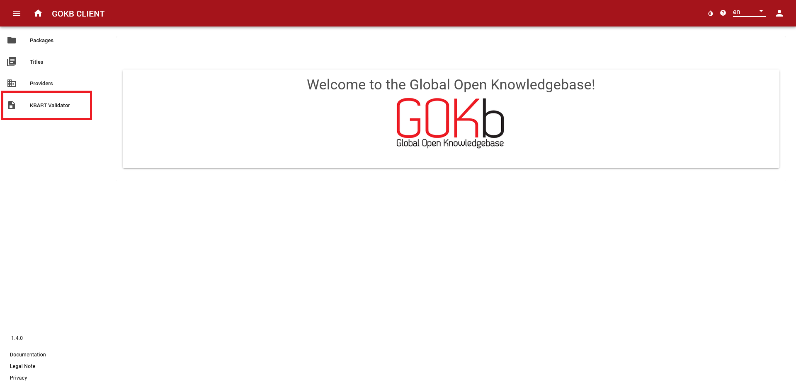
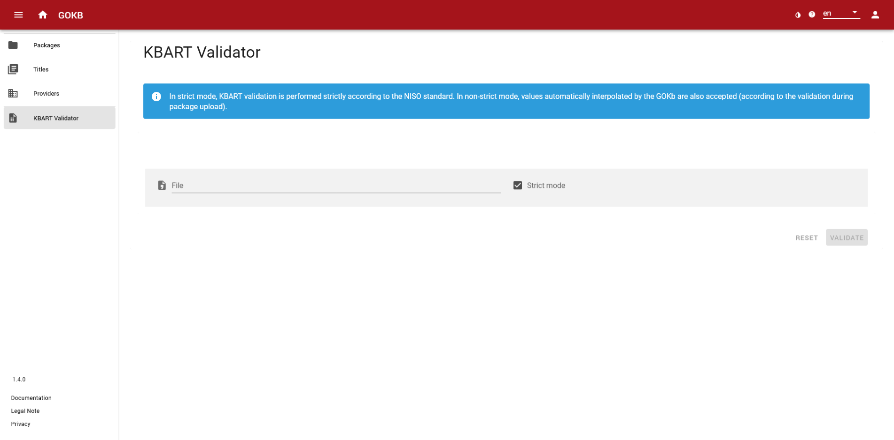
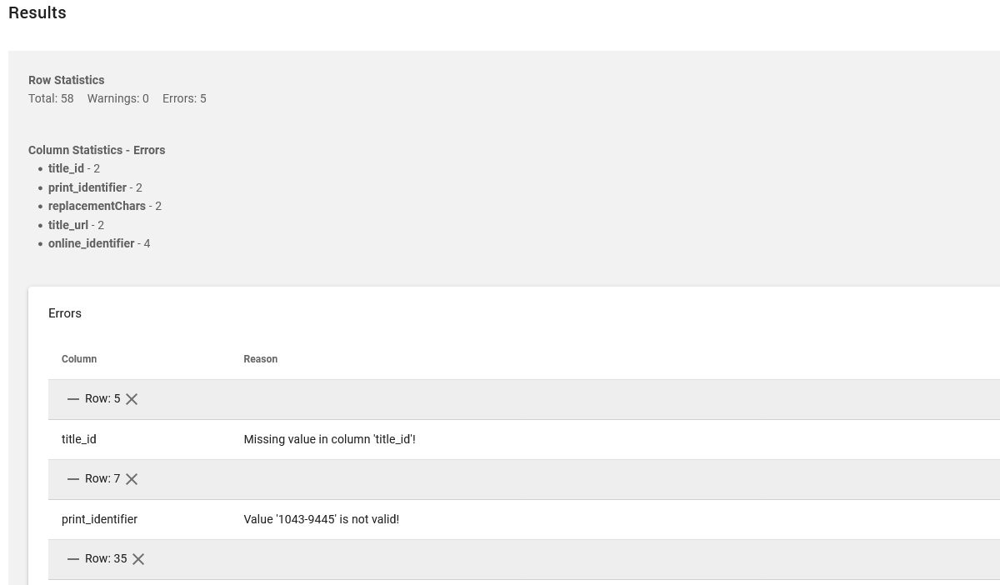
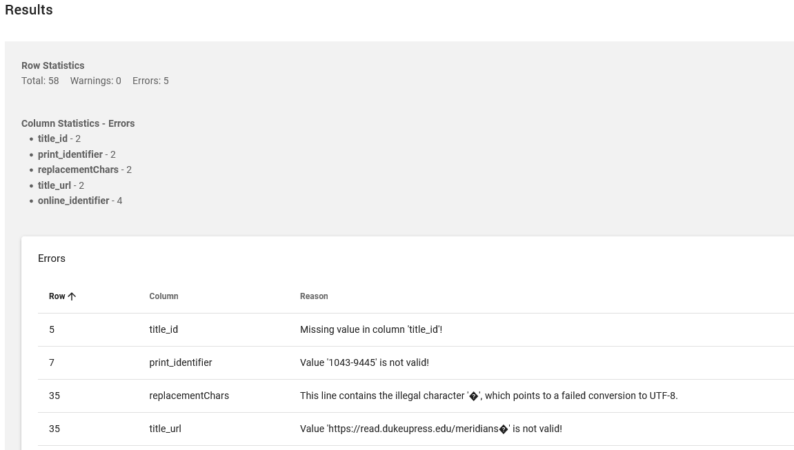

# KBART-Validator

The KBART Validator is a tool that allows you to check KBART files for their compliance with the [NISO Standard](https://www.niso.org/standards-committees/kbart).

## Upload file

Select the "KBART Validator" menu item in the left menu bar.

Click in the grayed out "File" field, select a file from your saved files and upload it via the "Open" button.

## Validate file

Use the slider to select whether you want to have the data validated in strict or non-strict mode. In strict mode, the validation process strictly follows the NISO standard. Non-strict mode corresponds to validation during package upload – this means that this mode accepts also non-standard values that are accepted and (if necessary) automatically adjusted by the GOKB.

To start the process, click the "Validate" button. If the result does not appear immediately, a loading icon will show you that the validation process is still active.

## Results

The displayed results of the validation consist of the following information:

+   **Row statistics:**: Here you get an overview of the rows of the KBART file (data records) that have errors or warnings.
+   **Column statistics:**: Here columns are named in which there are errors or warnings.

If you expand the "Errors" or "Warnings" tiles in the white fields, a detailed view of the errors and warnings read out appears. The line number indicates the corresponding data record of the KBART file. Below this the columns with errors in this line are listed with the cause of the error.

If you click on the cross behind the line specification, the view changes and you can sort the displayed lines by the value in ascending or descending order using the arrow symbol.

## Errors and warnings

An error differs from a warning by the severity of the occurrence. In strict mode there is no warning, because any deviation from the KBART standard is marked as an error. In non-strict mode, deviations from the standard, but accepted by the GOKB or not corrupting the data, are marked as warnings.

