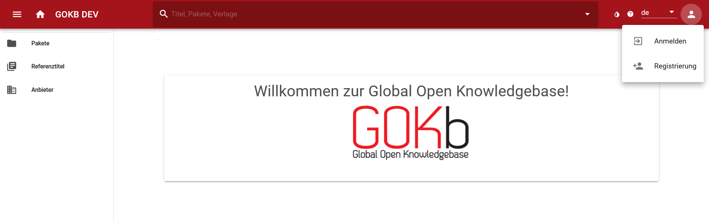

# Registrierung und Anmeldung

## Registrieren

Wenn Sie ein Konto in der GOKb anlegen wollen, gehen Sie wie folgt vor:

Rufen Sie die Global Open Knowledge Base (GOKb) über die URL [https://gokb.org/gokb-ui/](https://gokb.org/gokb-ui/) oder das Testsystem über die URL [https://gokbt.gbv.de/gokb-ui/](https://gokbt.gbv.de/gokb-ui/) auf. Wählen Sie die Registrierungsseite an, indem Sie oben rechts auf das Personen-Icon klicken und "Registrierung" anwählen.

Es öffnet sich ein Dialogfenster mit den Feldern zu Registrierung. Bitte füllen Sie Folgendes aus:

+   E-Mail: Geben Sie hier bitte eine korrekte Mailadresse an. Eine Registrierung ohne Angabe der E-Mail-Adresse ist zwar möglich, jedoch muss solch ein Konto manuell von einem Administrator freigeschaltet werden.
+   Benutzername: Wählen Sie hier einen passenden Nutzernamen für Ihr Konto.
+   Passwort: Geben Sie ein Passwort für Ihr Nutzerkonto an.

Bestätigen Sie anschließend das Passwort und beantworten Sie die Frage zur Erkennung, ob es sich um einen Bot handelt (Diese Frage dient dazu, Massenanmeldungen durch Bot-Programme zu verhindern). Klicken Sie nun auf "Konto anlegen".

Anschließend muss Ihr Konto aktiviert und einer Kuratorengruppe zugeordnet werden. Schicken Sie daher bitte eine E-Mail an gokb_at_hbz-nrw.de mit der Bitte um Freischaltung. Bitte fügen Sie in die Mail unbedingt ein:

+   Ihren gewählten Benutzernamen
+   Ihre Institution (für die Zuordnung bzw. das Anlegen einer Kuratorengruppe)

Die GOKb-Admins werden sich mit Ihnen in Verbindung setzen, sobald das Konto eingerichtet ist und Sie loslegen können.

## Anmelden

Rufen Sie die GOKb über die URL [https://gokb.org/gokb-ui/](https://gokb.org/gokb-ui/ "Login") auf. 
Klicken Sie oben rechts auf das Personen-Icon und wählen Sie "Anmelden". 
Geben Sie nun Benutzername und Passwort ein.

## Passwort vergessen? 

Falls Sie Ihr Passwort vergessen haben, können Sie es über 
[diese Seite](https://gokb.org/gokb/register/forgotPassword) im Produktiv- und
[diese Seite](https://gokbt.gbv.de/gokb/register/forgotPassword) im Testsystem 
wieder herstellen.

 
