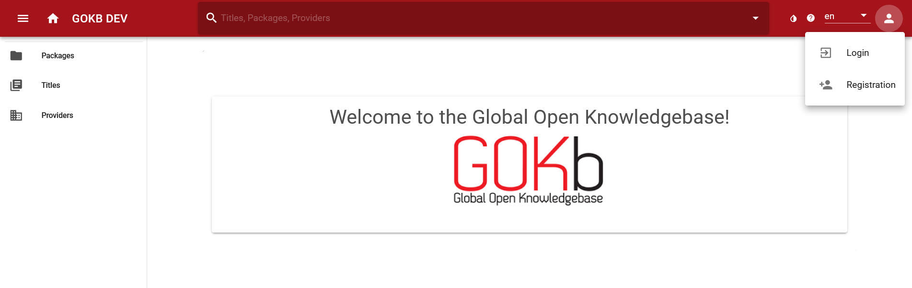
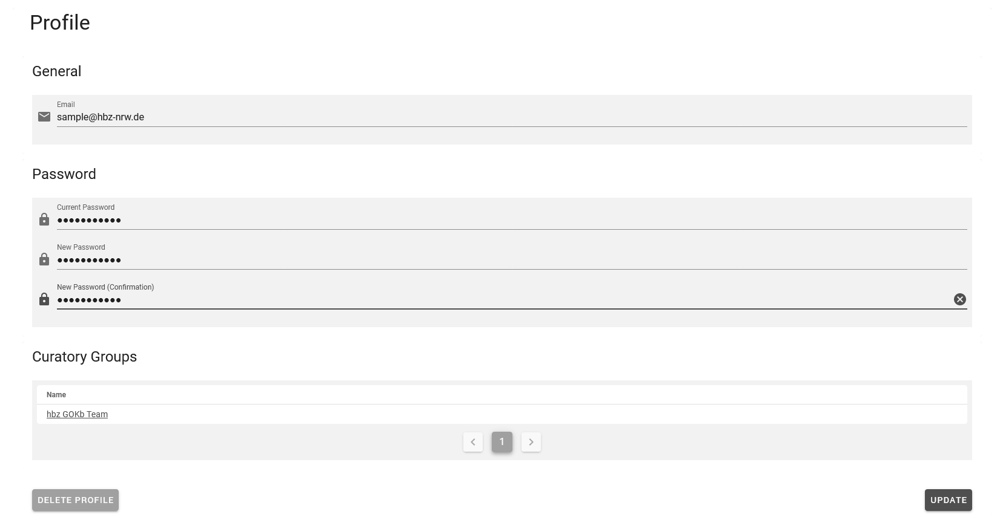

# Registration and login

## Registration

If you want to create an account in the GOKb, proceed as follows:

Access the Global Open Knowledge Base (GOKb) via the URL https://gokb.org/gokb-ui/ or the test system via the URL https://gokbt.gbv.de/gokb-ui/. Select the registration page by clicking on the person icon at the top right and selecting Registration.

A dialog box will open with the fields for registration. Please fill in the following information:

+ Email: Please enter a correct mail address here. It is possible to register without providing the email address, but such an account must be manually activated by an administrator.
+ Username: Choose an appropriate username for your account here.
+ Password: Enter a password for your user account.

Then confirm the password and answer the question (this question is used to prevent mass login by bot programs). Now click on "Create your account".

Afterwards, your account must be activated and assigned to a curator group. Therefore, please send a mail to gokb_at_hbz-nrw.de with the request for activation. Please be sure to include in the mail:

+ Your chosen username
+ Your institution (for the assignment or the creation of a curator group)

The GOKb admins will contact you as soon as the account is set up and you can get started.

## Login

Access GOKb via the URL [https://gokb.org/gokb-ui/](https://gokb.org/gokb-ui/ "Login"). Click on the user icon at the top right and select "Login" to log in. Enter your username and password there.

## Forgot password?

If you have forgotten your password, you can restore it via
[this page](https://gokb.org/gokb/register/forgotPassword) (alternatively 
[this page](https://gokbt.gbv.de/gokb/register/forgotPassword) in the playground system). 

## Change password

Log in, click on the round button in the upper right corner and select "Profile".

Now fill in the fields under "Password" to create a new password.

Click on "Update" at the bottom right. A banner will then appear indicating that the profile has been successfully edited. Your new password is now active.

Important notice: You cannot reset your password if you registered without an email address.
