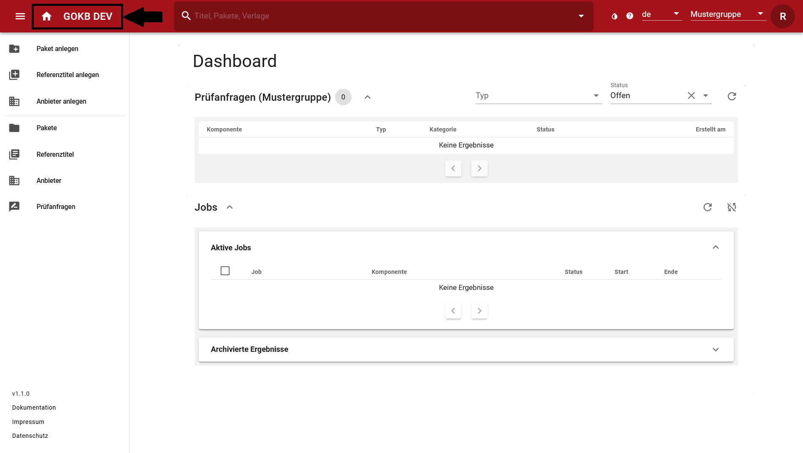
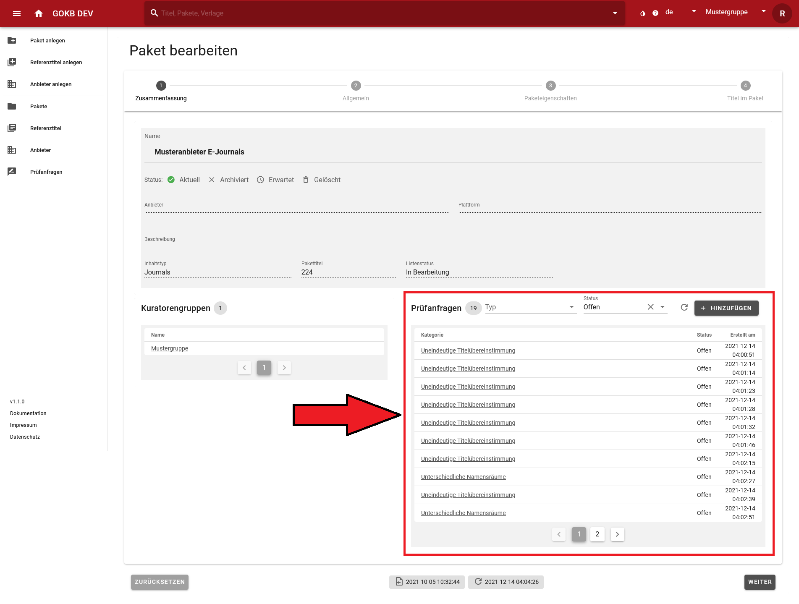
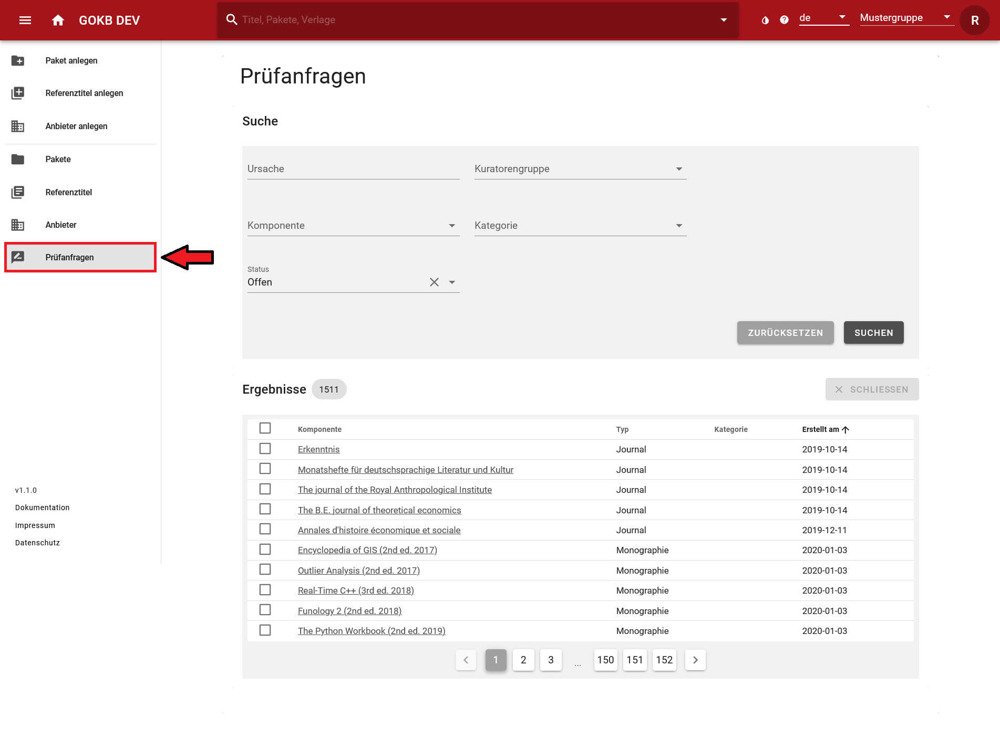
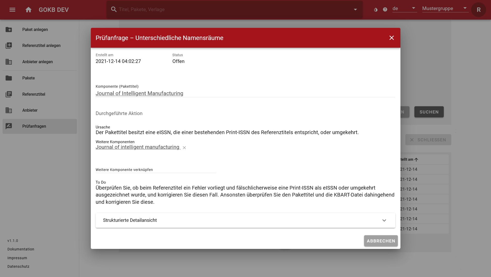

# Arbeiten mit Prüfanfragen

Prüfanfragen sind zentrale Workflow-Komponenten der GOKb. Über Prüfanfragen wird Ihnen 
mitgeteilt, ob bei der Bearbeitung oder dem Einspielen von Komponenten Fehler aufgetreten sind oder 
mögliche Ungereimtheiten entdeckt wurden. Auch einfache Informationen und Rückmeldungen werden 
Ihnen in Form von Prüfanfragen zurückgemeldet. 

Das Ziel jeder Kuratorengruppe sollte sein, alle Prüfanfragen zu einer Paketeinspielung anzusehen, 
ggf. zu bearbeiten und zu schließen. Dabei ist zu beachten:
  
  * Die Bearbeitung einer Prüfanfrage erfordert - abhängig von der Art der Prüfanfrage - eine 
  Bearbeitung der jeweiligen Komponente. Die Prüfanfrage muss danach manuell geschlossen werden.
  * Viele Prüfanfragen dienen nur zur Information und können ohne Bearbeitung geschlossen werden.
  * Die GOkb reagiert sehr sensibel auf mögliche Ungereimtheiten in den Daten. Gegebenenfalls 
  können so von dem System Prüfanfragen geöffnet werden, die nur vermeintlich einen Fehler 
  beschreiben, obwohl alles korrekt ist. Diese können nach Prüfung geschlossen werden. 

## Prüfanfragen finden

In der GOKb gibt es drei Wege, um Prüfanfragen zu finden.

  * Im Dashboard
  * In der Paketsicht
  * In der Prüfanfragen-Sicht
  
### Dashboard

Im Dashboard werden alle Prüfanfragen angezeigt, die der ausgewählten Kuratorengruppe zugeordnet sind. 

### In der Paketsicht

In der Paketsicht sind alle Prüfanfragen aufgeführt, die zum augenblicklich ausgewählten Paket gehören. 
Das umfasst sowohl Prüfanfragen, die das Paket insgesamt betreffen sowie Prüfanfragen zu den enhaltenen 
Pakettiteln sowie den zugehörigen Referenztiteln.

### In der Prüfanfragen-Sicht

Zur Prüfanfragen-Sicht gelangen Sie über das Menü. Hier können Sie alle Prüfanfragen der GOKb
finden und nach folgenden Kriterien filtern:

  * **Ursache** - Ein Freitextfeld
  * **Kuratorengruppe** - Auswahl der Kuratorengruppe, der die Prüfanfrage zugeordnet ist
  * **Komponente** - Ein Auswahlfeld, in dem alle Komponenten (Anbieter, Pakete, Titel etc.) suchbar sind
  * **Kategorie** - Eine Auswahl der Kategorien der Prüfanfragen. Eine Übersicht der Kategorien finden 
  Sie weiter unten.
  * **Status** - Eine Auswahl des Status der Prüfnafrage (Offen, Geschlossen, Gelöscht)
  

  
## Prüfanfragen einsehen und bearbeiten

In der jeweiligen Ergebnisliste finden Sie eine Übersicht über die Komponente, den Komponententyp (wie 
Journal, Paket etc.), die Kategorie der Prüfanfragen und das Erstellungsdatum. 

Über die Checkbox zu Beginn jeder Zeile können Sie eine oder mehrere Prüfanfragen anwählen und über den Button 
"Schließen" den Status auf "Geschlossen" setzen. 

Für eine Detailsicht der Prüfanfrage wählen Sie den Link unter der Spalte "Komponente" an

### Detailsicht

In der Detailsicht erhalten Sie verschiedene Informationen und Optionen:

  * **Erstellt am:** Das Feld zeigt das Datum der Erstellung der Prüfanfrage.
  * **Status:** Der Status ("Offen" oder "Geschlossen") gibt den Status der Prüfanfrage an. Wenn eine 
  Prüfanfrage bearbeitet ist, d.h. die geprüfte Komponente von Ihnen als korrekt angesehen wird (nach 
  einer Korrektur oder weil die Prüfanfrage keine weitere Bearbeitung erfordert), können Sie den Status 
  auf "Geschlossen" setzen.
  * **Komponente:** Dieses Feld gibt die genaue Komponente an, d.h. welches Paket, welche Plattform oder 
  welcher Anbieter für die Prüfanfrage ursächlich ist. 
  * **Durchgeführte Aktion:** Dieses Feld gibt an, wie die GOKb automatisiert mit dem festgestellten 
  Problem verfahren ist.
  * **Ursache:** Dieses Feld gibt die Ursache an, die zum Öffnen der Prüfanfrage geführt hat. 
  * **Weitere Komponenten:** Gibt es weitere Komponenten neben der zuvor angegebenen, die für die Prüfanfrage 
  ursächlich ist, so werden diese hier angezeigt. Sie können weitere Komponenten selbständig verknüpfen.
  * **To Do**: Falls eine Handlung von Ihnen als Nutzer*in erforderlich ist, erhalten Sie hier eine Anleitung.
  
Sie können die Prüfanfragen an dieser Stelle schließen und die Detailsicht über den Button "Aktualisieren" 
wieder verlassen. 
  

# Typen von Prüfanfragen

Hier finden Sie eine Auflistung von Prüfanfragen. Sie können über den Titel der Prüfanfrage direkt zum 
richtigen Eintrag springen.

  * Prüfanfragen für die Paketkuratierung
    * [Ungültige Pakettitel](#ungultige-pakettitel)
    * [Unterschiedliche Namensräume](#unterschiedliche-namensraume)
    * [Ungültiger KBART-Datensatz](#ungultiger-kbart-datensatz)
    * [Uneindeutiger KBART-Datensatz](#uneindeutiger-kbart-datensatz)
    * [Identifikatoren-Konflikt beim KBART-Import](#identifikatoren-konflikt-beim-kbart-import)
    * [Ergebnisbericht einer KBART-Einspielung](#ergebnisbericht-einer-kbart-einspielung)
  * Prüfanfragen für die Titelredaktion
    * [Uneindeutige Titelübereinstimmung](#uneindeutige-titelubereinstimmung)
    * [Unterschiedliche Namensräume](#unterschiedliche-namensraume)
    * [Identifikatoren-Konflikt (Neuer Titel)](#identifikatoren-konflikt-neuer-titel)
    * [Identifikatoren-Konflikt (ID ergänzt)](#identifikatoren-konflikt-id-erganzt)
    * [Generischer Matchingkonflikt](#generischer-matchingkonflikt)
    * [Abdeckungskonflikt](#abdeckungskonflikt)
  * Prüfanfragen für die Zentralredaktion
    * [Mehrere EZB-/ZDB-Kandidaten](#mehrere-ezb-zdb-kandidaten)
    * [EZB-ID/ZDB-ID bereits verwendet](#ezb-idzdb-id-bereits-verwendet)
    * [Keine EZB-/ZDB-Aufnahme gefunden](#keine-ezb-zdb-aufnahme-gefunden)
    
    

Jeder Eintrag ist wie folgt aufgebaut:
 
  * **Info:** Eine Erklärung, was es mit der Prüfanfrage auf sich hat.
  * **Aktion:** Ein Hinweis darauf, wie das GOKb-System automatisiert auf die Ursache der Prüfanfrage 
  reagiert hat. Ist der Eintrag leer, hat die GOKb nichts unternehmen können.
  * **toDo:** Hier ist erläutert, wie Sie als Kurator*in den möglichen Konflikt prüfen und lösen können. 
  Ist der Eintrag leer, diente die Prüfanfrage lediglich zu Ihrer Information und Sie müssen nichts 
  weiter tun.

## Prüfanfragen für die Paketkuratierung
### Ungültige Pakettitel

#### Info

Ein Aktualisierung des Pakets ist an ungültigen Pakettiteldaten gescheitert.

#### Aktion

Paket nicht aktualisiert

#### toDo

Überprüfen Sie die einzuspielenden Titelsätze auf Fehler oder fehlende Daten.

### Unterschiedliche Namensräume

#### Info

Der Pakettitel besitzt eine eISSN, die einer bestehenden Print-ISSN des Referenztitels 
entspricht, oder umgekehrt.
          
#### Aktion

keine 

#### toDo 

Überprüfen Sie, ob beim Referenztitel ein Fehler vorliegt und fälschlicherweise eine 
Print-ISSN als eISSN oder umgekehrt ausgezeichnet wurde, und korrigieren Sie diesen Fall. 
Ansonsten überprüfen Sie den Pakettitel und die KBART-Datei dahingehend und korrigieren Sie diese.

### Ungültiger KBART-Datensatz

#### Info 

Ein Datensatz der KBART-Datei enthält ungültige Werte. Es wurde kein Pakettitel angelegt.

#### Aktion

Kein Pakettitel angelegt
         
#### toDo

Überprüfen Sie den entsprechenden Datensatz in der KBART-Datei auf Fehler und korrigieren Sie ihn.

### Uneindeutiger KBART-Datensatz

#### Info

Ein Datensatz der KBART-Datei kann nicht eindeutig einem Pakettitel zugeordnet werden.

#### Aktion

Pakettitel ausgewähl

#### toDo

Überprüfen Sie den entsprechenden Datensatz sowie den Pakettitel, ob der korrekte 
Pakettitel ausgewählt wurde.

### Identifikatoren-Konflikt beim KBART-Import

#### Info 

Ein KBART-Datensatz konnte zwar anhand eines oder mehrerer Identifikatoren einem bestehenden 
Pakettitel zugordnet werden, allerdings unterscheidet sich ein wichtiger anderer bzw. andere 
Identifikatoren.

#### Aktion

Neuer Pakettitel angelegt

#### toDo

Überprüfen Sie die Pakettitel und führen sie beide gegebenenfalls zusammen.

### Ergebnisbericht einer KBART-Einspielung

#### Info

Eine KBART-Einspielung hat stattgefunden. Entnehmen Sie genauere Informationen bitte den Details.

#### Aktion 

Paket eingespielt

#### toDo

## Prüfanfragen für die Titelkuratierung

### Uneindeutige Titelübereinstimmung

#### Info 

Der Pakettitel kann anhand der vorliegenden Identifikatoren nicht eindeutig einem Referenztitel 
zugeordnet werden.

#### Aktion 

Kein Referenztitel verknüpft

#### toDo

Überprüfen Sie, ob bei den Referenztiteln eine Dublette vorliegt. Falls ja, führen Sie sie 
zusammen und verknüpfen diesen Titel manuell. Überprüfen Sie die Identifikatoren und löschen 
Sie gegebenenfalls welche, falls sie falsch sind.

### Unterschiedliche Namensräume

#### Info 

Der Pakettitel besitzt eine eISSN, die einer bestehenden Print-ISSN des Referenztitels 
entspricht, oder umgekehrt.

#### Aktion 

#### toDo

Überprüfen Sie, ob beim Referenztitel ein Fehler vorliegt und fälschlicherweise eine 
Print-ISSN als eISSN oder umgekehrt ausgezeichnet wurde, und korrigieren Sie diesen Fall. 
Ansonsten überprüfen Sie den Pakettitel und die KBART-Datei dahingehend und korrigieren 
Sie diese."

### Identifikatoren-Konflikt (Neuer Titel)

#### Info

Ein Referenztitel stimmt anhand eines Identifikators mit einem vorhandenen Referenztitel überein, 
aber andere Identifikatoren desselben Namensraumes stimmen nicht überein. Zudem unterscheidet 
sich der Referenztitelname stark.

#### Aktion

Neuer Referenztitel erstellt

#### toDo

Überprüfen Sie, ob hier tatsächlich ein neuer Referenztitel vorliegt. Ist er identisch mit dem 
vorhandenen, führen Sie beide zusammen. Überprüfen Sie die Identifikatoren und löschen Sie diese, 
falls sie falsch sind.

### Identifikatoren-Konflikt (ID ergänzt)

#### Info 

Ein Referenztitel stimmt mit dem vorhandenen Referenztitel überein, aber manche Identifikatoren 
desselben Namensraums stimmen nicht überein.

#### Aktion

Identifikator ergänzt

#### toDo

Überprüfen Sie die Identifikatoren des Referenztitels und löschen Sie diese, falls sie falsch sind.

### Generischer Matchingkonflikt

#### Info 

Es trat ein Konflikt beim Matching des Pakettitels mit bestehenden Referenztiteln auf.

#### Aktion
       
#### toDo 

Überprüfen Sie die betroffenen Titel und informieren Sie gegebenenfalls die GOKb-Redaktion.

### Abdeckungskonflikt

#### Info 

Der Erscheinungszeitraums des gefundenen Referenztitels stimmt nicht der Abdeckung überein.

#### Aktion

Referenztitelauswahl verhindert
          
#### toDo

Überprüfen Sie die Zeitangaben und damit eine manuelle Verknüpfung des Titels.

## Prüfanfragen für die Zentralredaktion

### Mehrere EZB-/ZDB-Kandidaten

#### Info 

Es gibt mehrere Kandidaten für den Titel.

#### Aktion

EZB-/ZDB-Anreicherung verhindert

#### toDo

Selektieren Sie die korrekte EZB-/ZDB-Aufnahme für den Titel.

### EZB-ID/ZDB-ID bereits verwendet

#### Info

Die gefundene EZB-ID/ZDB-ID ist bereits mit einem anderen Referenztitel verknüpft.

#### Aktion

#### ToDo

### Keine EZB-/ZDB-Aufnahme gefunden

#### Info

Für die gegebenen ISSNs wurde keine EZB-/ZDB-Aufnahme gefunden.
          
#### Aktion

EZB-/ZDB-Anreicherung übersprungen
          
#### toDo

## Anleitung zur Bearbeitung von Prüfanfragen
### Im Folgenden erklären wir Ihnen in einzelnen Schritten, wie Sie bestimmte Typen von Prüfanfragen bearbeiten können.

### ISSN Konflikt

Der Konflikt ist entstanden, weil der Pakettitel eine e-ISSN enthält, die einer bestehenden p-ISSN des Referenztitels entspricht, oder umgekehrt.

1. In der Kachel wird der zu korrigierende Titel mit den enthaltenen Identifikatoren angezeigt. Durch anklicken des Kästchens in der Tabelle wählen Sie die zu löschende ISSN aus.
2. Die Löschung aktivieren Sie überden Button "Titeländerungen Abschicken".
3. Um einen neuen Identifikator hinzuzufügen, klicken Sie auf den Titel. Es öffnet sich dann in einem neuen Fenster die Detailansicht.
4. Im Anschluss klicken Sie auf den Button "Prüfanfrage Abschliessen".

**Hinweis:** Print- und Onlineversion einer Zeitschrift müssen mit eigenen ISSNs ausgezeichnet werden. Verschiedene Nachweissysteme benutzen jedoch eine ISSN fälschlich für beide Versionen. Die autorisierten ISSNs finden Sie unter https://portal.issn.org/.

### Fehlerhafter Name

Der Konflikt ist entstanden, weil der Name des Titels ein fehlerhaftes Zeichen enthält.

1. Klicken Sie auf das Stift-Icon in der Kachel, das hinter dem zu prüfenden Titel angezeigt wird. Sie können so direkt im Feld die fehlerhaften Zeichen im Titelnamen anpassen. Die Korrektur wird übernommen, indem Sie den Haken am Ende des Feldes aktivieren.
2. Speichern Sie die Änderung des Titels über den Button "Titeländerungen Abschicken".
3. Überprüfen Sie ebenfalls die in der Kachel angezeigten Paket- bzw. Referenztitel. Mit einem Klick auf den Namen öffnet sich die Detailansicht in einem neuen Fenster. 
4. Die Prüfanfrage beenden Sie über den Button "Prüfunanfrage Abschliessen".

**Hinweis:** Fehlerhafte Zeichen im Titel tauchen immer dann auf, wenn KBART-Dateien eingespielt werden, die nicht UTF-8-konform sind. In der Dokumentation finden Sie eine [Anleitung](https://gokb.org/de/documentation/kbart-editing.html), wie man mit einem Tabellenkalkulationsprogramm Dateien in UTF-8 umwandelt und speichert. Für die korrekte Titelaufnahme kann die Verzeichnung in externen Quellen helfen.

