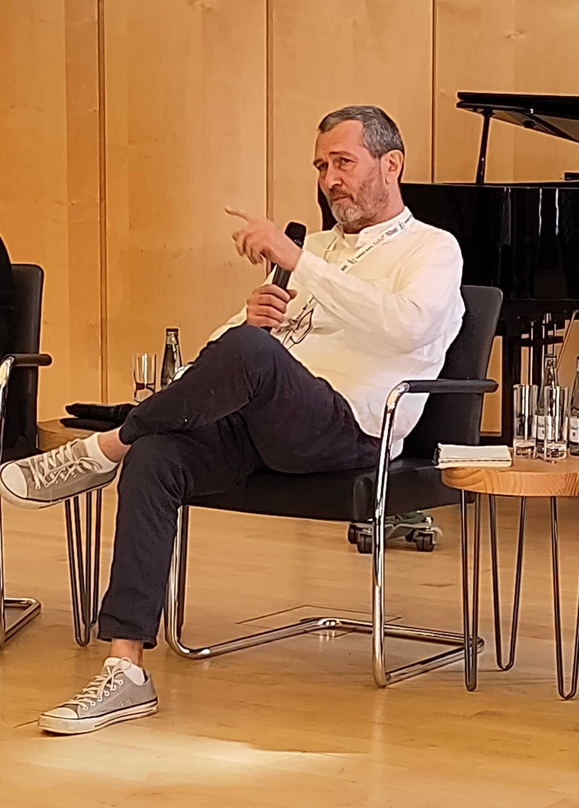

# News

## Save the date - GOKB Anwendertreffen im November 2024 in Göttingen
*06. Mai 2024*

Wir laden unsere Anwender*innen herzlich zu unserem ersten GOKB Anwendertreffen in Göttingen in der Alten Mensa ein. 

Reservieren Sie sich den **06. und 07. November 2024**. 

Weitere Informationen finden Sie in unserem **[Flyer](assets/Einladung_Anwendertreffen_Goettingen_112024.pdf)**.

## Save the date(s) - die GOKb auf der BiblioCon 2024
*07. Mai 2024*

Das Team der GOKb wird auch in diesem Jahr auf der BiblioCon in Hamburg vor Ort sein mit folgenden Veranstaltungen:

• **Mittwoch, 05.06. 09:00-10:30 Uhr** Vortrag in "Transformation braucht Daten": _Aktuelle Nutzungsszenarien der GOKb in der Verbundlandschaft_ von 09:00 bis 09:30 Uhr

• **Mittwoch, 05.06. 09:00-10:30 Uhr** Vorträge in "ZDB-Anwendertreffen": _Die Global Open Knowledegbase (GOKb) – Aktuelles_ von 10:00-10:15 Uhr & _Bearbeitung von Referenztiteln in GOKb und ZDB_ von 10:15-10:30 Uhr

• **Mittwoch, 05.06. 15:30-16:00 Uhr** Sprechstunde am Stand der Verbünde: _GOKb live - Ihr Werkzeug für Metadaten von E-Ressourcen_

• **Donnerstag, 06.06. 15:30-16:30 Uhr** #Freiraum24: _Global Open Knowledebase (GOKb): Austausch, Information, Diskussion_

• **Donnerstag, 06.06. 16:30-18:30 Uhr** Hands-on Lab: _Prüfanfragen und Paket-Metadaten: Datenoptimierung in der Global Open Knowledgebase (GOKb)_
  
Abseits dieser Termine können Sie uns natürlich jederzeit ansprechen. Wir freuen uns auf Sie!
  
Mehr Infos finden Sie unter dem Punkt [Programm](https://bibliocon2024.abstractserver.com/program/) auf der offiziellen Website.

## Ankündigung Infostunde im Mai 2024
*30. April 2024*

Die nächste Infostunde wird am _06. Mai_ stattfinden von 15 bis 16 Uhr. Der Schwerpunkt der Sitzung wird das Thema Anbieter sein.

## Ankündigung Infostunde im April 2024
*28. März 2024*

Die nächste Infostunde wird am _08. April_ stattfinden von 15 bis 16 Uhr. Wir werden Ihnen die geplante Umfrage zu "Identifikatoren von E-Ressourcen" vorstellen.

## Anmeldung für Mailinglisten
*05. März 2024*

Es gibt nun Mailinglisten, in denen Sie sich anmelden können, um zukünftig Updates und News sowie auch die Einladung zur Infostunde zu erhalten. Wir möchten Sie bitten, sich spätestens bis zum 08. April 2024 einzutragen.
Die Listen finden Sie auf der Seite [ole-lists.openlibraryfoundation.org](https://ole-lists.openlibraryfoundation.org/). Auswählen können Sie zwischen den beiden Listnamen _gokb-updates-dach (deutschsprachig)_ und _gokb-updates (international)_. Füllen Sie die ersten beiden Felder unter dem Punkt "Subcribe" aus und klicken Sie anschließend im Feld _List_ den Namen der gewünschten Mailingliste an. Das Kästchen unter den Feldern empfehlen wir frei zu lassen.

## Ankündigung Infostunde im März 2024
*21. Februar 2024*

Die nächste Infostunde wird am _04. März_ stattfinden von 15 bis 16 Uhr. Wir werden auf die Fallstricke bei KBART-Dateien und die Organisation der Community eingehen.

## Release 1.7 erschienen
*25. Januar 2024*

Das aktuelle Release 1.7 integriert die DDC-Klassifikation auf Titel- und Paketebene. Für Journals wird die DDC-Klassifikation automatisiert aus der ZDB in die Referenztitel übernommen. Außerdem sind mehr Sichten der GOKb durch eindeutige URLs ansteuerbar, sodass URLs zu einzelnen Reitern, konkreten Suchen und Pakettiteln gespeichert werden können. Näheres zum Release 1.7 finden Sie [hier](https://gokb.org/de/releases.html).

## Ankündigung Infostunde im Februar 2024
*12. Januar 2024*

Die nächste Infostunde wird am _05. Februar_ stattfinden von 15 bis 16 Uhr. Wir werden die Neuerungen aus dem Release 1.7 vorstellen.

## Wir trauern um Hans-Jörg Lieder

Mit großer Bestürzung haben wir vom plötzlichen Tod unseres sehr geschätzten Kollegen 
Hans-Jörg Lieder erfahren. Als Leiter der ZDB war er ein tragender Bestandteil des GOKb-Teams 
und hat uns über die Jahre stets mit viel Freundlichkeit, Humor, Kompetenz und Souveränität 
in verschiedenen Zusammenhängen vertreten. Auch in der täglichen Arbeit stand er mit 
Rat und Tat zur Seite und war dabei stets motivierend und unterstützend.

Charakteristisch für Hans-Jörg Lieder war sein Mitwirken auf der WolfCon 2022 in Hamburg, 
wo er die GOKb auf der Eröffnungsveranstaltung vertrat. Durch seine Präsenz, seine 
langjährige Erfahrung mit übergreifenden Fragestellungen und seine einnehmende Persönlichkeit
gelang es ihm, dieses Panel zu einem prägenden Austausch über die Positionierung der 
Bibliotheken in einer krisengeschüttelten Welt zu machen.

Erst vor wenigen Wochen wurde Hans-Jörg Lieder für die GOKb in das Board of Directors 
der Open Library Foundation gewählt, eine Rolle, in der er sich darauf freute, unser 
Projekt und die deutsche Community zu stärken. Wir sind uns sicher, dass ihm dies 
auch gelungen wäre.

Wir werden ihn als hervorragenden Kollegen und vor allem als warmherzigen Menschen
in Erinnerung behalten und vermissen ihn sehr. Unser besonderes Mitgefühl gilt seinen Angehörigen.

In Anteilnahme seine Kolleginnen und Kollegen der GOKb Moritz Horn, Kirstin Kemner-Heek,
Maike Osters, Johann Rolschewski, Daniel Rupp, Martina Schildt, Christin Seegert, 
Andrea Stei, Gerald Steilen

## Ankündigung Infostunde im Januar 2024
*12. Dezember 2023*

Die Infostunde im Januar enfällt. Im Februar geht es dann weiter. Infos dazu folgen.

## GOKb bei den FOLIO-Tagen 2023 in Stuttgart
*05. Oktober 2023*

Die 5. FOLIO-Tage Stuttgart finden vom 10. bis zum 11. Oktober als Präsenzveranstaltung statt. Hinweisen möchten wir auf folgende Veranstaltungen:

*10. Oktober*:

• 15:45 bis 16:45 Uhr: Die GOKb stellt sich vor
  
*11. Oktober*:

• 9 bis 10:30 Uhr: GOKb Anwender*innen-Treffen

• 10:45 bis 11:45 Uhr: ERM Workflow Demo (inkl. GOKb)

Das offizielle [Programm](https://www.bsz-bw.de/files/Bilder/Dokumente/FOLIO-Tage_Programm_2023_10_05_WWW.pdf) für die FOLIO-Tage ist online verfügbar.

## GOKb auf der WOLFcon 2023
*18. August 2023*

Die WOLFcon 2023, die jährliche Tagung der [Open Library Foundation (OLF)](https://openlibraryfoundation.org/about/wolfcon/upcoming/), findet in diesem Jahr vom 22. - 24. August als hybride Veranstaltung in Chicago statt. Die GOKb wird dort mit folgenden Themen vertreten sein:

- [New Workflows & Features in GOKb](https://static.sched.com/hosted_files/wolfcon2023/08/GOKb%20WOLFcon%202023%20-%20New%20workflows%20and%20features.pdf?_gl=1*1fvbq79*_ga*MTkzNzI1NTM3OC4xNjkzMjI3NTIy*_ga_XH5XM35VHB*MTY5NDA2NzYxMC40LjEuMTY5NDA2Nzc5Ni41OC4wLjA.)
- [Global Open Knowledgebase: Open Data, Open Source, Open API, Open Community](https://static.sched.com/hosted_files/wolfcon2023/0b/GOKb%20Wolfcon%202023%20Open.pdf?_gl=1*1o7w0xw*_ga*MTkzNzI1NTM3OC4xNjkzMjI3NTIy*_ga_XH5XM35VHB*MTY5NDA2NzYxMC40LjEuMTY5NDA2NzY1Ni4xNC4wLjA.)

## Release 1.6 erschienen
*26. Juli 2023*

Das aktuelle Release 1.6 bietet u. a. erweiterte Such- und Filterfunktionen. Identifikatoren können in der Suche nach Namensraum gefiltert werden. Zudem ist es beim Anbieter möglich, eine Kurzform des Namens einzutragen. Die Suchergebnisse können nun als csv exportiert werden. Eine weitere Neuerung ist die visuelle Aufteilung der Ansicht für das Bearbeiten von Plattformen. Näheres zum Release 1.6 finden Sie [hier](https://gokb.org/de/releases.html).

## Ankündigung GOKb Prüfanfragen-Schulung
*07. Juni 2023*

Am 27. Juni 2023 von 10 bis 12 Uhr wird es eine Prüfanfragen-Schulung geben. Alle sind herzlich eingeladen. Bei Interesse senden Sie bitte eine Mail an [info@gokb.org](info@gokb.org).

## GOKb auf der BiblioCON 2023
*23. Mai 2023*

Das Team der GOKb ist auf der BiblioCON 2023 in Hannover mit folgenden Veranstaltungen vertreten:

•	24. Mai von 14 bis 16 Uhr: Vortrag zum Thema [„GOKb & FOLIO – neue Möglichkeiten für die Verwaltung elektronischer Ressourcen“](https://dbt2023.abstractserver.com/program/#/details/presentations/199)

•	26. Mai von 9 bis 11 Uhr: Workshop [„Workflows für die Paketverwaltung mit der Global Open Knowledgebase (GOKb)“](https://dbt2023.abstractserver.com/program/#/details/sessions/84)

## Release 1.5 erschienen
*17. April 2023*

Mit dem Release 1.5 wurde in der GOKb vor allem die Darstellung der Prüfanfragen optimiert. Sie bietet nun eine bessere Übersicht sowie aussagekräftigere Hinweistexte, was zu einer erhöhten Usability beiträgt. Außerdem erfolgt nun eine verbesserte Rückmeldung bei der Validierung und beim Import von KBART-Dateien. Näheres zum Release 1.5 finden Sie [hier](https://gokb.org/de/releases.html).

## Release 1.4 erschienen
*15. Dezember 2022*

Release 1.4 der GOKb verbessert insbesondere die KBART-Validierung. Neben einer aussagekräftigen Rückmeldung 
beim Hochladen von KBART-Dateien gibt es jetzt auch einen eigenständigen KBART-Validator, der ohne Einloggen
in die GOKb KBART-Dateien auf ihre Korrektheit überprüft. Zahlreiche weitere Verbesserungen finden sich in den 
Release Notes [hier](./releases.md "GOKb Release Notes").

## Release 1.3 erschienen
*04. August 2022*

Heute erscheint mit Release 1.3 eine neue Version der GOKb mit zahlreichen Verbesserungen.  
Insbesondere wurde der Importprozess für im Hintergrund deutlich überarbeitet, sowohl im 
Hintergrund wie in den Oberfläche selbst, sodass das Einspielen von Paketen deutlich schneller, fehlerfreier 
und übersichtlicher geschieht. Die Such- und Filtersichten für Pakete, Referenztitel etc. wurden außerdem 
überarbeitet und unterstützen jetzt boolesche Operatoren und erweiterte Trunkierung. 

Die genauen Release Notes finden Sie [hier](./releases.md "GOKb Release Notes").

## GOKb auf der WOLFCon 2022
*05. Juli 2022*

Die WOLFCon 2022, die jährliche Tagung der [Open Library Foundation (OLF)](https://openlibraryfoundation.org/
"Open Library Foundation (OLF)"), findet dieses Jahr vom 31. August - 2. September als hybride Veranstaltung 
in Hamburg statt. Da die GOKb wie auch FOLIO ein Projekt unter dem Schirm der OLF ist, ist sie dort wieder mit
mehreren Sessions vertreten:

- The GOKb as a Bridge between Provider Data and FOLIO Agreements.
- Cross project: FOLIO ERM & GOKb - Presentation of a Service
- Closing Review Requests: The Process for Cleaning up Provider Data with GOKb
- Collect and Distribute: Utilizing the APIs of GOKb

Die Anmeldung für die WOLFCon ist noch offen und kann über die [Website der WOLFCon](https://openlibraryfoundation.org/about/wolfcon/upcoming/ "WOLFCon 2022") 
erfolgen.  

## GOKb auf dem BID2022
*10. Juni 2022*

Die GOKb war auf dem 8. Bibliothekskonkress in Leipzig vertreten. In der Session "New Generation Systems"
hielt Daniel A. Rupp den Vortrag "Die Global Open Knowledgebase (GOKb) - Von der Anbieterdatei zum FOLIO-Paket" 
über den Weg, den eine KBART-Datei von der Seite des Anbieters über die GOKb in nachgelagerte ERM-Systeme wie 
FOLIO nimmt. Zentral ist dabei die Aufbereitung der Daten durch die GOKb für eine elektronische Weitergabe, die 
Korrektur möglicher Fehler und die Anreicherung der Daten durch bibliographische Daten und Identifikatoren. 
Abstract und Folien finden sich auf der Seite des [BIB OPUS Publikationsservers](https://opus4.kobv.de/opus4-bib-info/frontdoor/index/index/docId/18011 
"Die GLobal Open Knowledgebase (GOKb) - Von der Anbieterdatei zum FOLIO-Paket"). Moritz Horn und Daniel A. Rupp
hielten außerdem den gut besuchten Workshop [Paketanreicherung mit der Global Open Knowledgebase (GOKb)](https://opus4.kobv.de/opus4-bib-info/frontdoor/index/index/docId/18029 
"Paketanreicherung mit der Global Open Knowledgebase (GOKb)") ab. Hier konnten Bibliothekar*innen am eigenen
Laptop die Einspielung und Bearbeitung von Paketen in die GOKb testen. 

## Release 1.2 erschienen
*18. März 2022*

Das neue Release 1.2 der GOKb wurde am 18. März veröffentlicht. Neben der Differenzierung 
von Kuratorengruppen in Paket- und Titelredaktion und der Möglichkeit, Prüfanfragen 
zu eskalieren, wurde die KBART-Validierung und vor allem die Aktualisierung vorhandener 
Pakete deutlich verbessert. Die genauen Release Notes finden Sie [hier](./releases.md "GOKb Release Notes").

## Neue Version
*9. November 2021*

Die GOKb-Version 1.1 ist veröffentlicht. In dieser Version wurde der Einspielprozess 
für die KBART-Dateien deutlich umgestaltet und läuft nun merklich effizienter und stabiler. 
Die Farbgestaltung der Oberfläche wurde ebenfalls überarbeitet. Die genauen Release 
Notes finden Sie [hier](./releases.md "GOKb Release Notes"). 

## GOKb Infostunden

*1. September 2021*

Nachdem die Einspielung von Daten in die GOKb deutlich vereinfacht wurde und da die Zahl 
der die GOKb nutzenden und an der GOKb interessierten Bibliotheken wächst - nicht zuletzt 
wegen der Einführung von FOLIO - wollen wir vom GOKb-Team in einem regelmäßigen Turnus über 
die Plattform informieren, neue Features zeigen und zum Austausch anregen.. Aus diesem Grund 
finden künftig an jedem ersten Montag im Monat offene GOKb-Infostunden ohne vorherige Anmeldung 
statt. Wenn Sie in den Verteiler für diese Infostunden aufgenommen werden wollen, senden Sie 
bitte eine kurze Notiz an gokb@hbz-nrw.de 

## Neue Bedienoberfläche

*1. September 2020*

Die GOKb hat eine neue Bedienoberfläche! Auf Grundlage eines gemeinsam mit Nutzer*innen 
entwickelten Konzepts wurde die Bedienoberfläche mit moderner Technologie (Vue.js) komplett 
neu entwickelt. Im Fokus der Entwicklung standen dabei eine gute Benutzungsführung und die 
Reduzierung der Komplexität: Die Paketeinspielung erfolgt jetzt in vier einfachen Schritten. 
Überflüssige Felder und ungenutzte Eigenschaften wurden konsequent entfernt. Die Anbieter- und 
Plattformverwaltung ist nun ebenfalls deutlich vereinfacht.

Das GOKb-System im Hintergrund bleibt gleich, d.h. dass alle Nutzer*innenkonten und Daten 
erhalten bleiben.. Die alte Nutzeroberfläche wird nicht mehr weiter unterstützt oder gewartet. 

## Erweiterter Import-Client

*25. Mai 2020*

Die erweiterte Version des GOKb-Importclients YGOR ist jetzt online unter
[https://gokb.org/ygor](https://gokb.org/ygor) verfügbar. Mit dieser Version wird eine detaillierte Ansicht jedes
importierten Datensatzes angezeigt, einschließlich einer Rückmeldung über fehlerhafte oder problematische
Datenwerte und die Möglichkeit, diese manuell direkt in der der GUI zu korrigieren. 
Eine Speicher- und Ladefunktion erlaubt es, den Uploadprozess jederzeit anzuhalten und
und fortsetzen. 
Es ist nicht mehr erforderlich anzugeben, ob es sich um ein Zeitschriften- oder E-Book-Paket handelt, 
da diese Information aus den entsprechenden KBART-Feldern interpretiert wird, so dass ein Upload von gemischten Paketen jetzt möglich ist. 
Eine Dokumentation, wie KBART-Daten über den YGOR-Client importiert und angereichert werden, ist im GOkb-Wiki zu finden:
[https://openlibraryenvironment.atlassian.net/wiki/spaces/GOKB/overview](https://openlibraryenvironment.atlassian.net/wiki/spaces/GOKB/overview).
