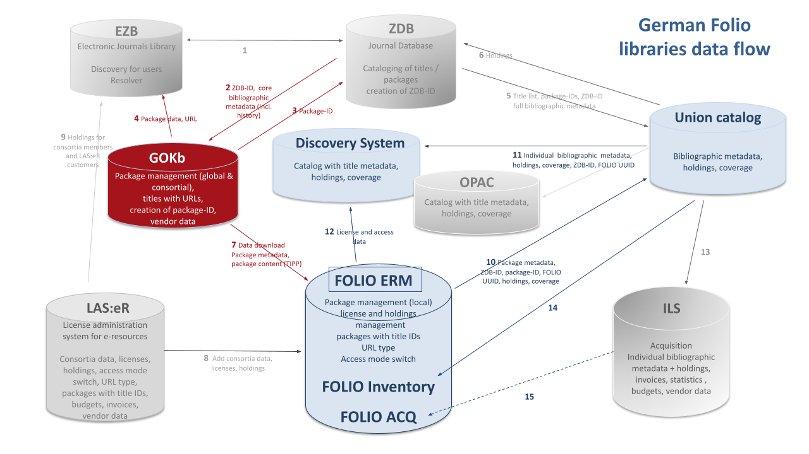

# News

## GOKb at the BiblioCON 2023
*May 23, 2023*

The GOKb team will be represented at BiblioCon 2023 in Hannover with the following events:

•	May 24 from 2 to 4 p.m.: Presentation on [„GOKb & FOLIO – new possibilities for managing electronic resources“](https://dbt2023.abstractserver.com/program/#/details/presentations/199)

•	May 26 from 9 to 11 a.m.: Workshop [„Workflows for package management with the Global Open Knowledgebase (GOKb)“](https://dbt2023.abstractserver.com/program/#/details/sessions/84)

## Release 1.5 published
*April 17, 2023*

With the release 1.5, the display of check requests in the GOKb has been optimized. It now offers a better overview as well as adapted hint texts, which contributes to an increased usability. In addition, there is now improved feedback during validation and when importing KBART files. More information about Release 1.5 can be found [here](https://gokb.org/de/releases.html).

## Release 1.4 published
*December 15, 2022*

Release 1.4 of GOKb improves in particular the KBART validation. In addition to a meaningful feedback
when uploading KBART files, there is now also a stand-alone KBART validator which can check
the correctness of KBART files without logging into GOKb. Numerous other improvements can be found in the
Release Notes [here](./releases.md "GOKb Release Notes").

## New Release 1.3
*August 04, 2022*

GOKb Release 1.3 has been published. The import process has been improved considerably
both in the background as well as in the user interface, so that the import of packages less error-prone
and gives better feedback. Search and filter views for packages, reference titles, etc. have also been improved
and now support Boolean operators and advanced truncation.

The detailed release notes can be found [here](./releases.md "GOKb Release Notes").

## WOLFCon 2022
*July 05, 2022*

This year, WOLFCon 2022, the annual meeting of the [Open Library Foundation (OLF)](https://openlibraryfoundation.org/
"Open Library Foundation (OLF)"), will take place as a hybrid event in Hamburg from August 31 to September 2. GOKb 
will be present with several sessions: 

- The GOKb as a Bridge between Provider Data and FOLIO Agreements.
- Cross project: FOLIO ERM & GOKb - Presentation of a Service
- Closing Review Requests: The Process for Cleaning up Provider Data with GOKb
- Collect and Distribute: Utilizing the APIs of GOKb

Registration for WOLFCon is still open and can be done via the [WOLFCon website](https://openlibraryfoundation.org/about/wolfcon/upcoming/ "WOLFCon 2022").

## New Release 1.2 

*March 18, 2022*

GOKb Release 1.2 has been published. Now you can choose your curatory group to specialize 
in package import or in bibliographic title redaction. Review Request can be escalated to 
another group. Further, KBART validation has been improved. Please find the release notes 
[here](./releases.md "GOKb Release Notes").

## New Release 1.1

*November 18, 2021*

GOKb-version 1.1 was published. For this version the import routines were 
significantly updated and optimised and now run much smoother. The colour 
scheme of the graphic interface was also redesigned. Please find the release 
notes [here](./releases.md "GOKb Release Notes").

## GOKb & Folio: data flow

*October 6, 2021*

In Germany the GOKb has central role for the management of electronic resource packages. 
It provides data to national union catalogues like EZB & ZDB, but also to local library systems like Folio:

## New User Interface

*September 1, 2020*

The GOKb has a new user interface! Based on a concept jointly developed with our users 
we have newly coded the interfacec using modern technologies (Vue.js). The main focus of 
this redesign was improved user guidance and the reduction of complexity. The import of 
package data is now realised in four easy steps. Redundant features were eliminated and 
the management of provider and platform data was also streamlined.

The GOKb system running in the background remains the same, so that legacy data will 
be preserved. The old interfaces will from now on not be supported anymore.

## Enhanced Import Client

*May 25, 2020*

The enhanced version of the GOKb import client YGOR is now online at
https://gokb.org/ygor. With this version, a detailed view of each
imported record is shown including feedback on erroneous or problematic
data values and the possibility to correct those manually directly in
the GUI. A saving and loading functionality allows stopping and
continuing the upload process at any time. A manual selection of the
content type of the package (serial or monograph) is no longer
necessary, as this information will be interpreted from the
corresponding KBART fields, so an upload of mixed packages is now
possible. A documentation on how to import and enrich KBART data via the
YGOR client can be found in the GOkb wiki:
<https://openlibraryenvironment.atlassian.net/wiki/spaces/GOKB/overview>.

## User interface study & pilot phase

*April 15, 2019*

In 2018 a study for a new user interface for GOKb was funded by the
Bundesministerium für Bildung und Forschung (Federal Ministry of
Education and Research). Results were published in April 2019 and will
be implemented within the next year.

Independently of this development, GOKb began a data ingest pilot phase
incorporating 19 German libraries and consortia. The pilot participants
will ingest KBART packages into GOKb and maintain them there. They will
share their experiences and discuss with the editorial staff at regular
conference calls. The pilot phase is open for all institutions. Please
request a GOKb account https://gokbt.gbv.de/gokb/register, and send an
email to info@gokb.org for further information.

## New import client ‘YGOR’

*January 21, 2019*

The North Rhine-Westphalian Library Service Centre (hbz) developed a new
GOKb import client: YGOR. YGOR is a multilingual web client which
supports the upload of KBART files to GOKb. With its help journal titles
are automatically compared to the title data of the German Union
Catalogue of Serials (ZDB) and enriched with the ZDB-ID, an identifier
that is utilized by all participating information systems in Germany and
Austria, thereby disambiguating the journal titles. The client no longer
relies on OpenRefine but rather uses the cross referencing API of GOKb.
The prototype is hosted at https://gokbt.gbv.de/ygor/. A [GOKb user
account](mailto:info@gokb.org) for the ingest of data is required.

## GOKb Forum

*May 5, 2018*

GOKb, formerly run by North Carolina State University, has reorganised
as a new coalition of partners. GOKb was formed under the Kuali
Foundation as a sister project of Kuali OLE.GOKb is now a community of
the Open Library Foundation (OLF), along with OLE and FOLIO, among
others. At the GOKb Forum event we will introduce new members of the
project team and their respective backgrounds. We will also inform in
detail about the current activities of the GOKb project team (matching
of data against bibliographic databases, new user interface study,
participation in FOLIO ERM Sub Group).

## GOKb Planning Meeting 2017

*July 1, 2017*

The international GOKb partner institutions met in Berlin to discuss the
future orientation and organisation of GOKb. The North Rhine-Westphalian
Library Service Centre (hbz), the Head Office of the GBV (VZG), and the
German Union Catalogue of Serials (ZDB) joined the GOKb steering
committee and formally took over the responsibilities of hosting and
further developing GOKb.

## Invitation to Establish the Open Library Foundation Global Open Knowledgebase

*June 1, 2017*

The Open Library Foundation (OLF) invited the Global Open Knowledgebase
(GOKb) to join its community as a project. For this purpose the GOKb
steering committee will establish a Community Charter that describes the
mission, organisation, and activities of the GOKb community.
